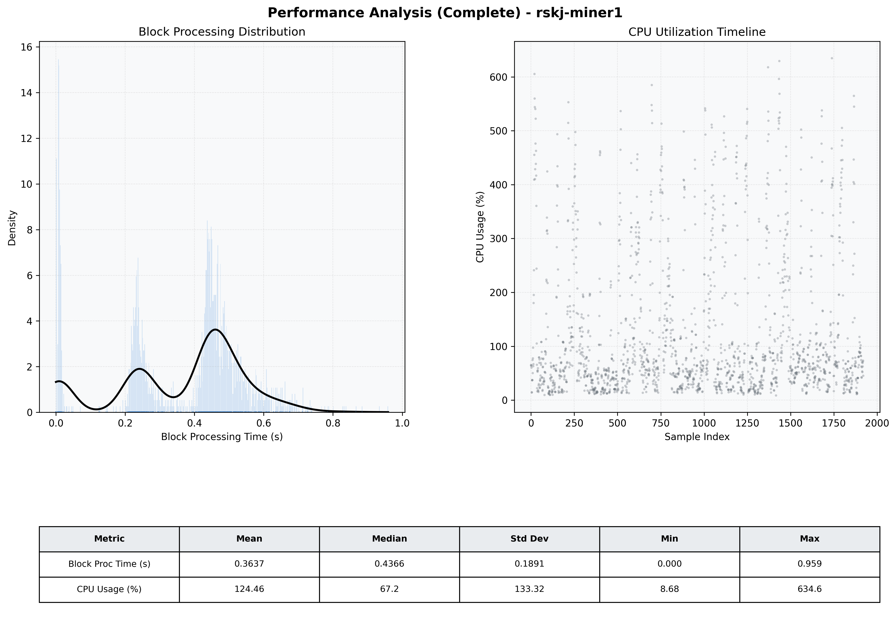

# Miner1 Quantitative Performance Report

| Category | Metric | Unit | Mean | Median | Min | Max |
| :--- | :--- | :--- | :--- | :--- | :--- | :--- |
| Processing | Block Processing Time | s | 0.364 | 0.437 | 0.000 | 0.959 |
|  | BlockExecution JMX | s | 0.250 | 0.237 | 0.003 | 0.578 |
| | Gas Consumed (per block) | M units | 6.05 | 7.00 | 0.00 | 7.00 |
| JVM | JVM Heap Used | MiB | 1711.7 | 1702.9 | 125.4 | 3329.7 |
| | JVM Heap Allocated | MiB | 5120.0 | 5120.0 | 5120.0 | 5120.0 |
| JVM GC | GC Copy Time | s | N/A | N/A | N/A | N/A |
| JVM GC | GC MarkSweep Time | s | N/A | N/A | N/A | N/A |
| Disk I/O | Disk Read | MiB/s | 0.002 | 0.000 | 0.000 | 3.586 |
|  | Disk Write | MiB/s | 691.688 | 483.432 | 0.000 | 3481.967 |
| Network | Received Network Traffic per Container | KiB/s | 2.50 | 2.08 | 1.36 | 6.40 |
|  | Sent Network Traffic per Container | KiB/s | 10.77 | 10.39 | 9.30 | 16.55 |
| Resources | CPU Usage per Container | % | 124.46 | 67.18 | 8.68 | 634.57 |
|  | Memory Usage per Container | MiB | 5389.5 | 5434.2 | 5017.1 | 5605.1 |
| | CPU & Memory Assigned | - | 4.0 CPU, 8G | - | - | - |
| | MALLOC_ARENA_MAX | - | N/A | - | - | - |

