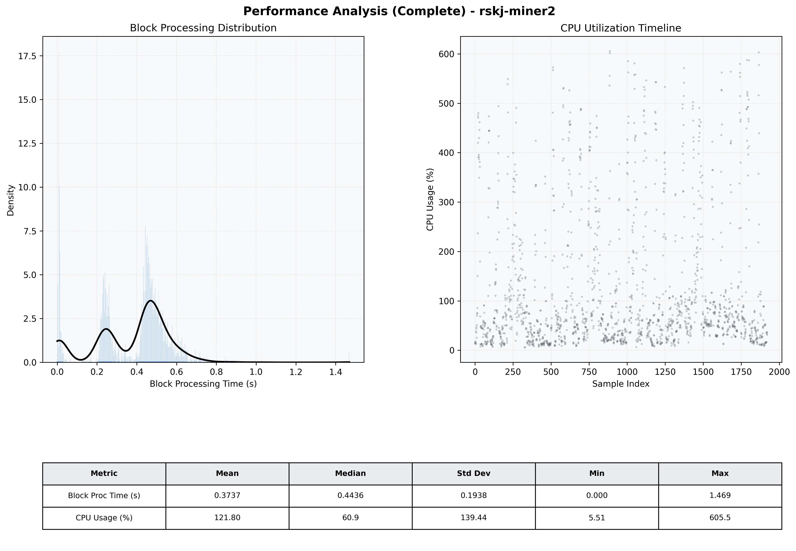

# Miner2 Quantitative Performance Report

| Category | Metric | Unit | Mean | Median | Min | Max |
| :--- | :--- | :--- | :--- | :--- | :--- | :--- |
| Processing | Block Processing Time | s | 0.374 | 0.444 | 0.000 | 1.469 |
|  | BlockExecution JMX | s | 0.249 | 0.240 | 0.003 | 1.212 |
| | Gas Consumed (per block) | M units | 6.05 | 7.00 | 0.00 | 7.00 |
| JVM | JVM Heap Used | MiB | 1738.5 | 1760.5 | 124.7 | 3308.4 |
| | JVM Heap Allocated | MiB | 5120.0 | 5120.0 | 5120.0 | 5120.0 |
| JVM GC | GC Copy Time | s | N/A | N/A | N/A | N/A |
| JVM GC | GC MarkSweep Time | s | N/A | N/A | N/A | N/A |
| Disk I/O | Disk Read | MiB/s | 0.001 | 0.000 | 0.000 | 0.828 |
|  | Disk Write | MiB/s | 693.383 | 483.327 | 0.000 | 3683.775 |
| Network | Received Network Traffic per Container | KiB/s | 2.80 | 2.27 | 1.36 | 8.35 |
|  | Sent Network Traffic per Container | KiB/s | 11.33 | 10.61 | 9.28 | 20.37 |
| Resources | CPU Usage per Container | % | 121.80 | 60.91 | 5.51 | 605.52 |
|  | Memory Usage per Container | MiB | 5463.2 | 5478.6 | 5134.5 | 5763.0 |
| | CPU & Memory Assigned | - | 4.0 CPU, 8G | - | - | - |
| | MALLOC_ARENA_MAX | - | N/A | - | - | - |

