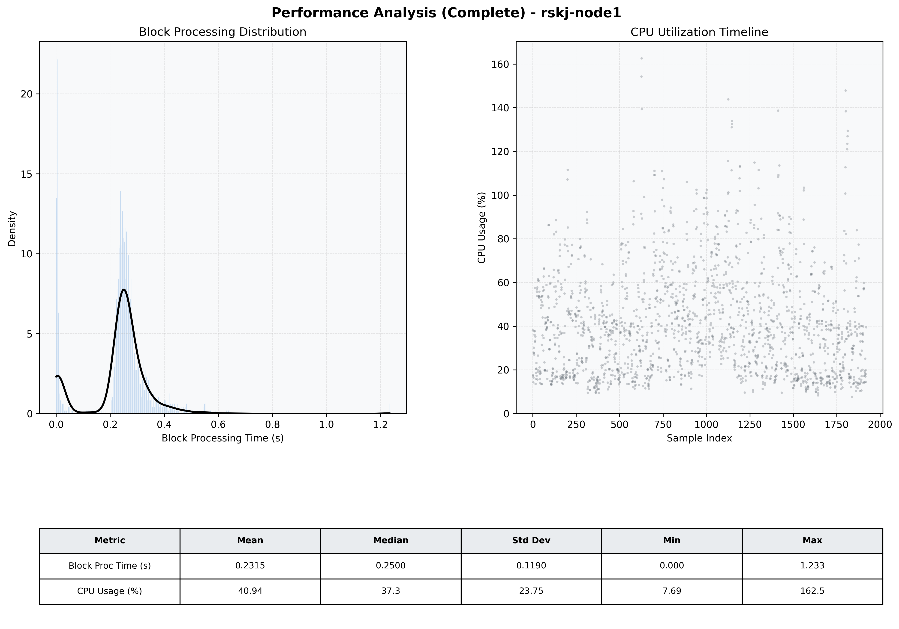

# Node1 Quantitative Performance Report

| Category | Metric | Unit | Mean | Median | Min | Max |
| :--- | :--- | :--- | :--- | :--- | :--- | :--- |
| Processing | Block Processing Time | s | 0.232 | 0.250 | 0.000 | 1.233 |
|  | BlockExecution JMX | s | 0.234 | 0.245 | 0.002 | 0.850 |
| | Gas Consumed (per block) | M units | 6.05 | 7.00 | 0.00 | 7.00 |
| JVM | JVM Heap Used | MiB | 1041.8 | 1036.3 | 84.8 | 2018.7 |
| | JVM Heap Allocated | MiB | 4096.0 | 4096.0 | 4096.0 | 4096.0 |
| JVM GC | GC Copy Time | s | N/A | N/A | N/A | N/A |
| JVM GC | GC MarkSweep Time | s | N/A | N/A | N/A | N/A |
| Disk I/O | Disk Read | MiB/s | 0.001 | 0.000 | 0.000 | 0.828 |
|  | Disk Write | MiB/s | 81.939 | 82.624 | 0.000 | 437.472 |
| Network | Received Network Traffic per Container | KiB/s | 2.90 | 2.32 | 1.37 | 8.55 |
|  | Sent Network Traffic per Container | KiB/s | 10.87 | 10.38 | 9.25 | 16.41 |
| Resources | CPU Usage per Container | % | 40.94 | 37.26 | 7.69 | 162.55 |
|  | Memory Usage per Container | MiB | 2739.7 | 2744.1 | 2531.4 | 2929.5 |
| | CPU & Memory Assigned | - | 2.0 CPU, 6G | - | - | - |
| | MALLOC_ARENA_MAX | - | N/A | - | - | - |

