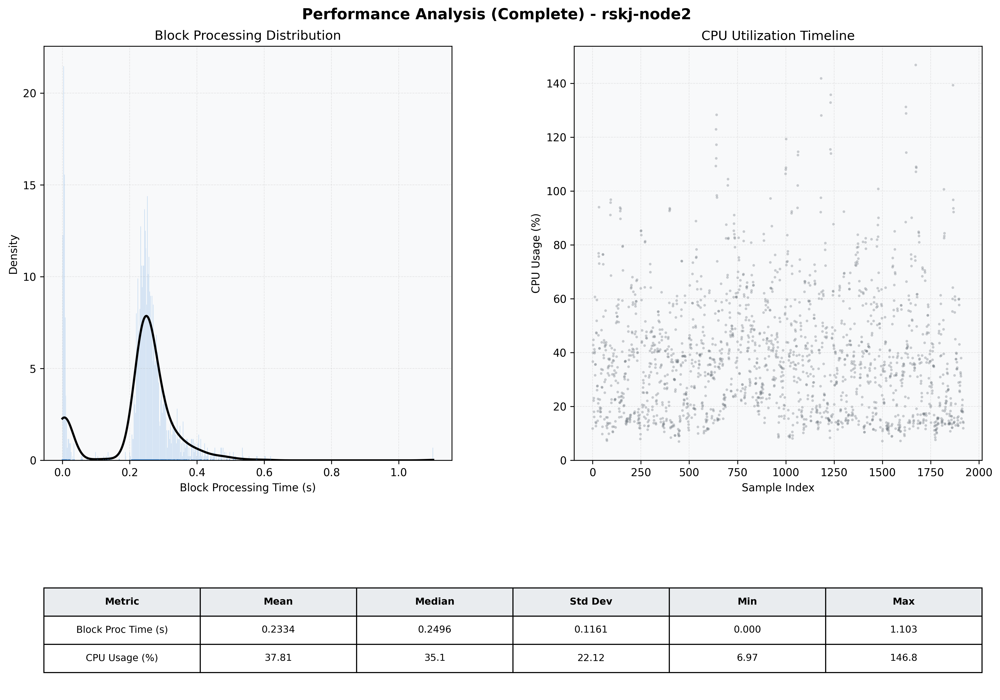

# Node2 Quantitative Performance Report

| Category | Metric | Unit | Mean | Median | Min | Max |
| :--- | :--- | :--- | :--- | :--- | :--- | :--- |
| Processing | Block Processing Time | s | 0.233 | 0.250 | 0.000 | 1.103 |
|  | BlockExecution JMX | s | 0.235 | 0.245 | 0.002 | 0.856 |
| | Gas Consumed (per block) | M units | 6.05 | 7.00 | 0.00 | 7.00 |
| JVM | JVM Heap Used | MiB | 1039.6 | 1040.5 | 65.8 | 2008.4 |
| | JVM Heap Allocated | MiB | 4096.0 | 4096.0 | 4096.0 | 4096.0 |
| JVM GC | GC Copy Time | s | N/A | N/A | N/A | N/A |
| JVM GC | GC MarkSweep Time | s | N/A | N/A | N/A | N/A |
| Disk I/O | Disk Read | MiB/s | 0.001 | 0.000 | 0.000 | 0.828 |
|  | Disk Write | MiB/s | 81.559 | 82.480 | 0.000 | 422.606 |
| Network | Received Network Traffic per Container | KiB/s | 2.77 | 2.27 | 1.36 | 7.35 |
|  | Sent Network Traffic per Container | KiB/s | 10.36 | 10.11 | 9.28 | 13.29 |
| Resources | CPU Usage per Container | % | 37.81 | 35.05 | 6.97 | 146.82 |
|  | Memory Usage per Container | MiB | 2690.9 | 2698.5 | 2481.2 | 2876.4 |
| | CPU & Memory Assigned | - | 2.0 CPU, 6G | - | - | - |
| | MALLOC_ARENA_MAX | - | N/A | - | - | - |

