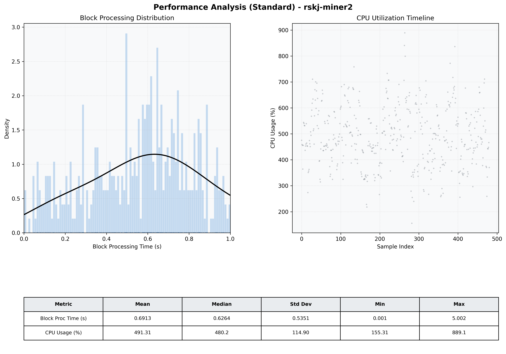

# Miner2 Quantitative Performance Report

| Category | Metric | Unit | Mean | Median | Min | Max |
| :--- | :--- | :--- | :--- | :--- | :--- | :--- |
| Processing | Block Processing Time | s | 0.691 | 0.626 | 0.001 | 5.002 |
|  | BlockExecution JMX | s | 0.493 | 0.523 | 0.024 | 0.998 |
| | Gas Consumed (per block) | M units | 8.42 | 10.00 | 0.04 | 10.00 |
| JVM | JVM Heap Used | MiB | 3022.4 | 3009.3 | 730.6 | 4584.1 |
| | JVM Heap Allocated | MiB | 5120.0 | 5120.0 | 5120.0 | 5120.0 |
| JVM GC | GC Copy Time | s | N/A | N/A | N/A | N/A |
| JVM GC | GC MarkSweep Time | s | N/A | N/A | N/A | N/A |
| Disk I/O | Disk Read | MiB/s | 230.532 | 125.108 | 0.000 | 4386.207 |
|  | Disk Write | MiB/s | 936.530 | 785.628 | 0.000 | 19865.389 |
| Network | Received Network Traffic per Container | KiB/s | 28.93 | 30.50 | 11.97 | 43.88 |
|  | Sent Network Traffic per Container | KiB/s | 42.38 | 42.85 | 21.33 | 62.15 |
| Resources | CPU Usage per Container | % | 491.31 | 480.24 | 155.31 | 889.10 |
|  | Memory Usage per Container | MiB | 7815.7 | 7966.8 | 6964.3 | 8191.9 |
| | CPU & Memory Assigned | - | 4.0 CPU, 8G | - | - | - |
| | MALLOC_ARENA_MAX | - | N/A | - | - | - |

