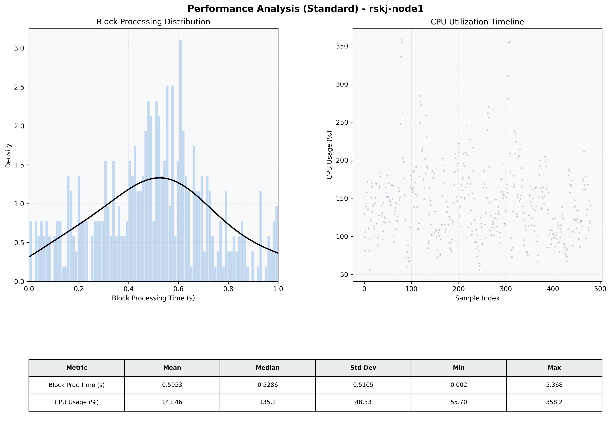

# Node1 Quantitative Performance Report

| Category | Metric | Unit | Mean | Median | Min | Max |
| :--- | :--- | :--- | :--- | :--- | :--- | :--- |
| Processing | Block Processing Time | s | 0.595 | 0.529 | 0.002 | 5.368 |
|  | BlockExecution JMX | s | 0.419 | 0.419 | 0.011 | 0.973 |
| | Gas Consumed (per block) | M units | 8.42 | 10.00 | 0.04 | 10.00 |
| JVM | JVM Heap Used | MiB | 1625.1 | 1648.6 | 489.4 | 2707.6 |
| | JVM Heap Allocated | MiB | 4096.0 | 4096.0 | 4096.0 | 4096.0 |
| JVM GC | GC Copy Time | s | N/A | N/A | N/A | N/A |
| JVM GC | GC MarkSweep Time | s | N/A | N/A | N/A | N/A |
| Disk I/O | Disk Read | MiB/s | 73.200 | 20.553 | 0.000 | 876.414 |
|  | Disk Write | MiB/s | 134.786 | 5.379 | 0.000 | 16987.242 |
| Network | Received Network Traffic per Container | KiB/s | 31.54 | 33.16 | 14.33 | 46.00 |
|  | Sent Network Traffic per Container | KiB/s | 35.79 | 37.35 | 20.12 | 49.29 |
| Resources | CPU Usage per Container | % | 141.46 | 135.24 | 55.70 | 358.22 |
|  | Memory Usage per Container | MiB | 5160.1 | 5293.6 | 4266.1 | 5453.1 |
| | CPU & Memory Assigned | - | 2.0 CPU, 6G | - | - | - |
| | MALLOC_ARENA_MAX | - | N/A | - | - | - |

