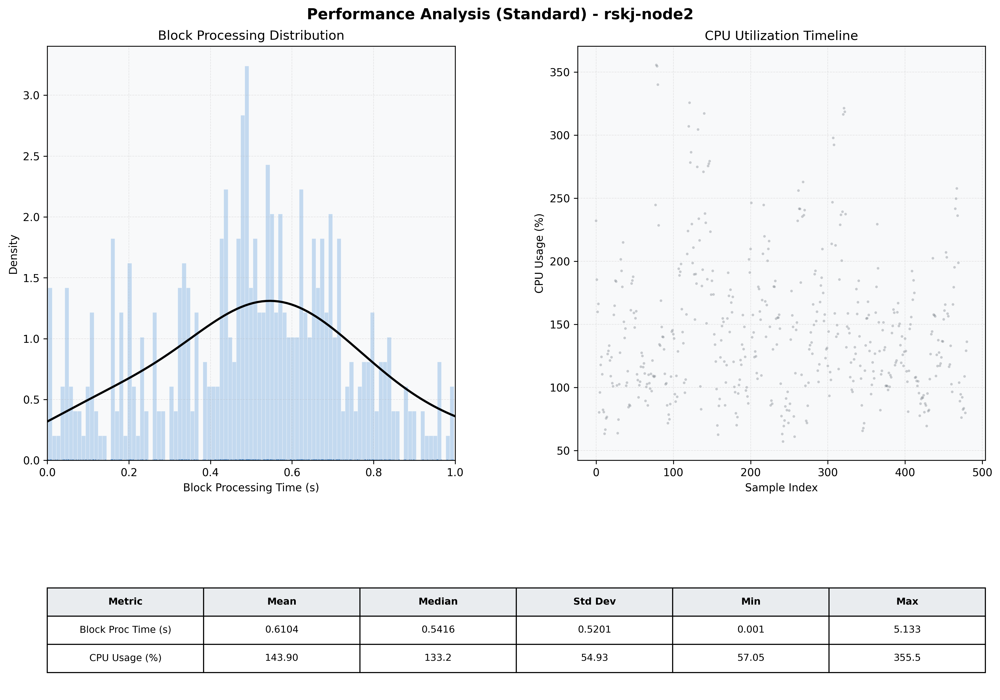

# Node2 Quantitative Performance Report

| Category | Metric | Unit | Mean | Median | Min | Max |
| :--- | :--- | :--- | :--- | :--- | :--- | :--- |
| Processing | Block Processing Time | s | 0.610 | 0.542 | 0.001 | 5.133 |
|  | BlockExecution JMX | s | 0.433 | 0.430 | 0.014 | 0.993 |
| | Gas Consumed (per block) | M units | 8.42 | 10.00 | 0.04 | 10.00 |
| JVM | JVM Heap Used | MiB | 1624.3 | 1615.6 | 463.7 | 2733.0 |
| | JVM Heap Allocated | MiB | 4096.0 | 4096.0 | 4096.0 | 4096.0 |
| JVM GC | GC Copy Time | s | N/A | N/A | N/A | N/A |
| JVM GC | GC MarkSweep Time | s | N/A | N/A | N/A | N/A |
| Disk I/O | Disk Read | MiB/s | 71.069 | 21.933 | 0.000 | 1686.737 |
|  | Disk Write | MiB/s | 146.068 | 20.136 | 4.138 | 16704.089 |
| Network | Received Network Traffic per Container | KiB/s | 32.16 | 33.79 | 14.46 | 49.30 |
|  | Sent Network Traffic per Container | KiB/s | 35.11 | 36.49 | 18.37 | 48.31 |
| Resources | CPU Usage per Container | % | 143.90 | 133.22 | 57.05 | 355.54 |
|  | Memory Usage per Container | MiB | 5248.9 | 5367.2 | 4247.4 | 5530.4 |
| | CPU & Memory Assigned | - | 2.0 CPU, 6G | - | - | - |
| | MALLOC_ARENA_MAX | - | N/A | - | - | - |

