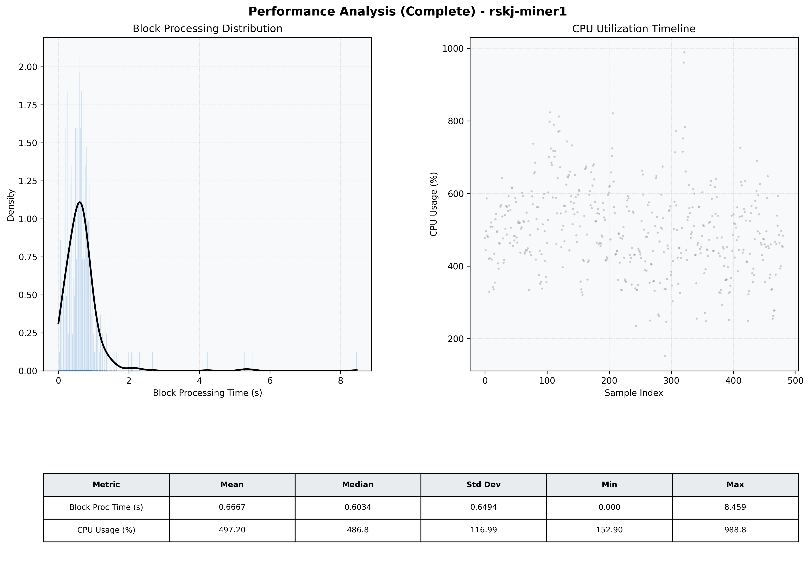

# Miner1 Quantitative Performance Report

| Category | Metric | Unit | Mean | Median | Min | Max |
| :--- | :--- | :--- | :--- | :--- | :--- | :--- |
| Processing | Block Processing Time | s | 0.667 | 0.603 | 0.000 | 8.459 |
|  | BlockExecution JMX | s | 0.596 | 0.530 | 0.039 | 8.263 |
| | Gas Consumed (per block) | M units | 8.42 | 10.00 | 0.04 | 10.00 |
| JVM | JVM Heap Used | MiB | 3103.1 | 3175.6 | 1021.4 | 4585.8 |
| | JVM Heap Allocated | MiB | 5120.0 | 5120.0 | 5120.0 | 5120.0 |
| JVM GC | GC Copy Time | s | N/A | N/A | N/A | N/A |
| JVM GC | GC MarkSweep Time | s | N/A | N/A | N/A | N/A |
| Disk I/O | Disk Read | MiB/s | 183.764 | 108.552 | 0.000 | 4806.345 |
|  | Disk Write | MiB/s | 920.219 | 730.044 | 0.000 | 19920.006 |
| Network | Received Network Traffic per Container | KiB/s | 29.20 | 29.86 | 11.95 | 44.71 |
|  | Sent Network Traffic per Container | KiB/s | 37.49 | 38.04 | 22.30 | 58.11 |
| Resources | CPU Usage per Container | % | 497.20 | 486.82 | 152.90 | 988.84 |
|  | Memory Usage per Container | MiB | 7693.1 | 7707.1 | 6716.8 | 8192.0 |
| | CPU & Memory Assigned | - | 4.0 CPU, 8G | - | - | - |
| | MALLOC_ARENA_MAX | - | N/A | - | - | - |

