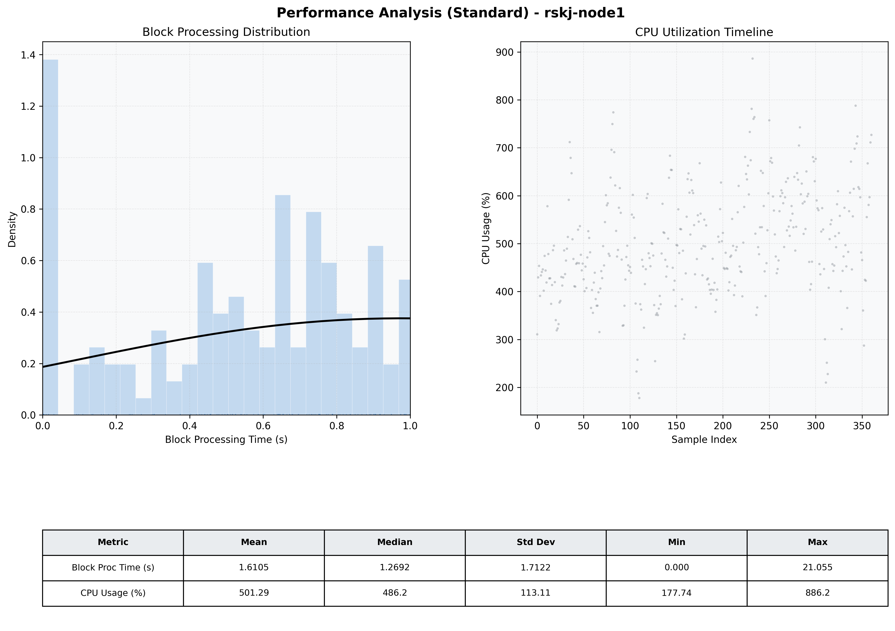

# Node1 Quantitative Performance Report

| Category | Metric | Unit | Mean | Median | Min | Max |
| :--- | :--- | :--- | :--- | :--- | :--- | :--- |
| Processing | Block Processing Time | s | 1.610 | 1.269 | 0.000 | 21.055 |
|  | BlockExecution JMX | s | 0.492 | 0.480 | 0.033 | 0.992 |
| | Gas Consumed (per block) | M units | 22.50 | 24.99 | 10.21 | 24.99 |
| JVM | JVM Heap Used | MiB | 1564.5 | 1534.2 | 455.1 | 3521.8 |
| | JVM Heap Allocated | MiB | 4096.0 | 4096.0 | 4096.0 | 4096.0 |
| JVM GC | GC Copy Time | s | N/A | N/A | N/A | N/A |
| JVM GC | GC MarkSweep Time | s | N/A | N/A | N/A | N/A |
| Disk I/O | Disk Read | MiB/s | 172.139 | 4.138 | 0.000 | 4559.823 |
|  | Disk Write | MiB/s | 425.000 | 155.575 | 0.000 | 9407.586 |
| Network | Received Network Traffic per Container | KiB/s | 81.59 | 82.35 | 22.63 | 123.21 |
|  | Sent Network Traffic per Container | KiB/s | 72.46 | 72.78 | 10.09 | 120.98 |
| Resources | CPU Usage per Container | % | 501.29 | 486.17 | 177.74 | 886.21 |
|  | Memory Usage per Container | MiB | 4832.7 | 5053.4 | 3421.9 | 5675.1 |
| | CPU & Memory Assigned | - | 2.0 CPU, 6G | - | - | - |
| | MALLOC_ARENA_MAX | - | N/A | - | - | - |

