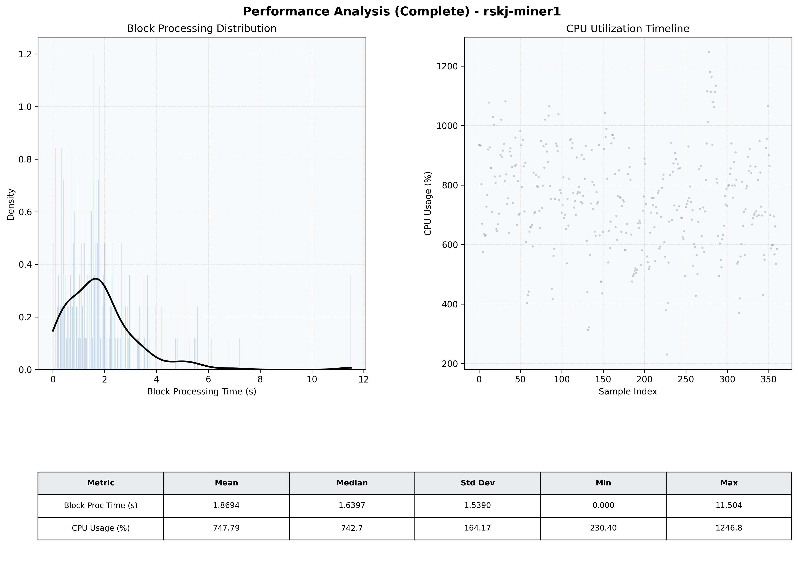

# Miner1 Quantitative Performance Report

| Category | Metric | Unit | Mean | Median | Min | Max |
| :--- | :--- | :--- | :--- | :--- | :--- | :--- |
| Processing | Block Processing Time | s | 1.869 | 1.640 | 0.000 | 11.504 |
|  | BlockExecution JMX | s | 1.409 | 1.153 | 0.064 | 8.534 |
| | Gas Consumed (per block) | M units | 22.50 | 24.99 | 10.21 | 24.99 |
| JVM | JVM Heap Used | MiB | 2787.1 | 2737.0 | 578.7 | 4555.7 |
| | JVM Heap Allocated | MiB | 5120.0 | 5120.0 | 5120.0 | 5120.0 |
| JVM GC | GC Copy Time | s | N/A | N/A | N/A | N/A |
| JVM GC | GC MarkSweep Time | s | N/A | N/A | N/A | N/A |
| Disk I/O | Disk Read | MiB/s | 165.815 | 48.695 | 0.000 | 7184.881 |
|  | Disk Write | MiB/s | 0.002 | 0.002 | 0.000 | 0.011 |
| Network | Received Network Traffic per Container | KiB/s | 74.82 | 76.54 | 26.46 | 112.83 |
|  | Sent Network Traffic per Container | KiB/s | 89.89 | 90.05 | 13.42 | 144.37 |
| Resources | CPU Usage per Container | % | 747.79 | 742.68 | 230.40 | 1246.76 |
|  | Memory Usage per Container | MiB | 7213.1 | 7239.9 | 5965.5 | 8191.3 |
| | CPU & Memory Assigned | - | 4.0 CPU, 8G | - | - | - |
| | MALLOC_ARENA_MAX | - | N/A | - | - | - |

