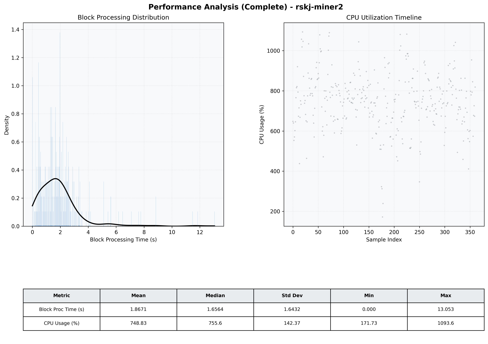

# Miner2 Quantitative Performance Report

| Category | Metric | Unit | Mean | Median | Min | Max |
| :--- | :--- | :--- | :--- | :--- | :--- | :--- |
| Processing | Block Processing Time | s | 1.867 | 1.656 | 0.000 | 13.053 |
|  | BlockExecution JMX | s | 1.468 | 1.172 | 0.050 | 11.003 |
| | Gas Consumed (per block) | M units | 22.50 | 24.99 | 10.21 | 24.99 |
| JVM | JVM Heap Used | MiB | 2883.2 | 2910.7 | 521.9 | 4550.7 |
| | JVM Heap Allocated | MiB | 5120.0 | 5120.0 | 5120.0 | 5120.0 |
| JVM GC | GC Copy Time | s | N/A | N/A | N/A | N/A |
| JVM GC | GC MarkSweep Time | s | N/A | N/A | N/A | N/A |
| Disk I/O | Disk Read | MiB/s | 138.021 | 9.242 | 0.000 | 4363.147 |
|  | Disk Write | MiB/s | 0.002 | 0.002 | 0.000 | 0.010 |
| Network | Received Network Traffic per Container | KiB/s | 73.61 | 74.38 | 24.87 | 121.57 |
|  | Sent Network Traffic per Container | KiB/s | 100.79 | 101.26 | 38.81 | 148.30 |
| Resources | CPU Usage per Container | % | 748.83 | 755.57 | 171.73 | 1093.57 |
|  | Memory Usage per Container | MiB | 7112.3 | 7122.9 | 5844.0 | 8146.7 |
| | CPU & Memory Assigned | - | 4.0 CPU, 8G | - | - | - |
| | MALLOC_ARENA_MAX | - | N/A | - | - | - |

