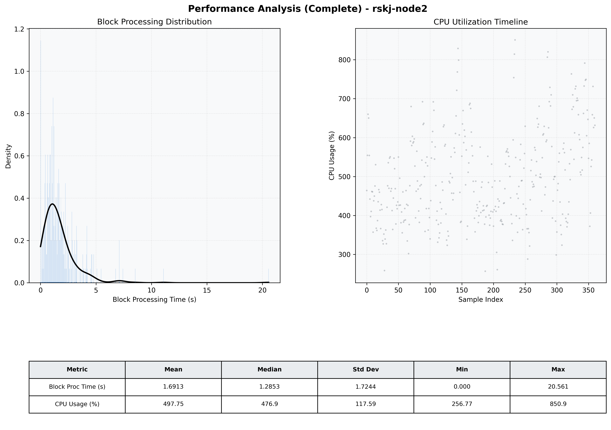

# Node2 Quantitative Performance Report

| Category | Metric | Unit | Mean | Median | Min | Max |
| :--- | :--- | :--- | :--- | :--- | :--- | :--- |
| Processing | Block Processing Time | s | 1.691 | 1.285 | 0.000 | 20.561 |
|  | BlockExecution JMX | s | 1.178 | 0.735 | 0.035 | 16.370 |
| | Gas Consumed (per block) | M units | 22.50 | 24.99 | 10.21 | 24.99 |
| JVM | JVM Heap Used | MiB | 1538.5 | 1522.8 | 386.2 | 3063.2 |
| | JVM Heap Allocated | MiB | 4096.0 | 4096.0 | 4096.0 | 4096.0 |
| JVM GC | GC Copy Time | s | N/A | N/A | N/A | N/A |
| JVM GC | GC MarkSweep Time | s | N/A | N/A | N/A | N/A |
| Disk I/O | Disk Read | MiB/s | 156.903 | 9.791 | 0.000 | 3465.278 |
|  | Disk Write | MiB/s | 452.762 | 160.679 | 0.000 | 9891.569 |
| Network | Received Network Traffic per Container | KiB/s | 83.68 | 84.95 | 27.92 | 137.67 |
|  | Sent Network Traffic per Container | KiB/s | 68.14 | 69.60 | 23.30 | 109.20 |
| Resources | CPU Usage per Container | % | 497.75 | 476.88 | 256.77 | 850.93 |
|  | Memory Usage per Container | MiB | 5083.2 | 5235.1 | 3727.4 | 5878.7 |
| | CPU & Memory Assigned | - | 2.0 CPU, 6G | - | - | - |
| | MALLOC_ARENA_MAX | - | N/A | - | - | - |

