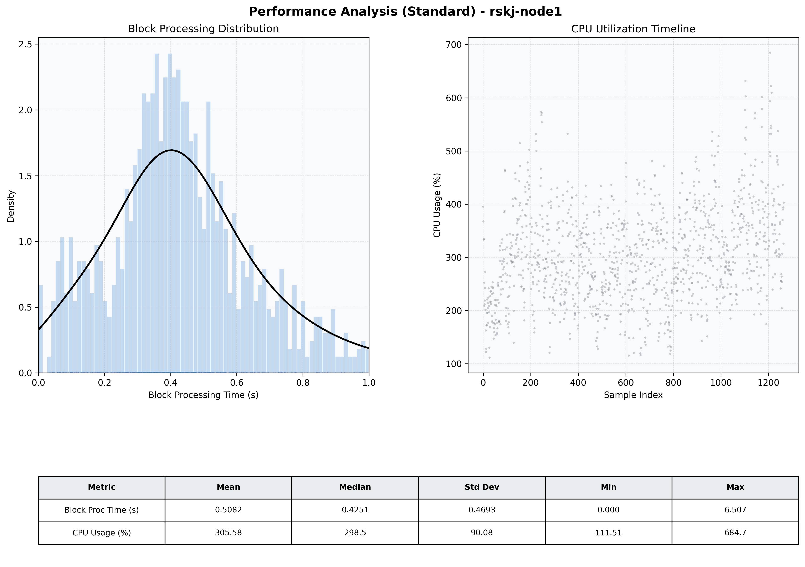

# Node1 Quantitative Performance Report

| Category | Metric | Unit | Mean | Median | Min | Max |
| :--- | :--- | :--- | :--- | :--- | :--- | :--- |
| Processing | Block Processing Time | s | 0.508 | 0.425 | 0.000 | 6.507 |
|  | BlockExecution JMX | s | 0.333 | 0.301 | 0.016 | 0.981 |
| | Gas Consumed (per block) | M units | 6.99 | 6.99 | 5.21 | 6.99 |
| JVM | JVM Heap Used | MiB | 1604.1 | 1595.8 | 157.1 | 2871.2 |
| | JVM Heap Allocated | MiB | 4096.0 | 4096.0 | 4096.0 | 4096.0 |
| JVM GC | GC Copy Time | s | N/A | N/A | N/A | N/A |
| JVM GC | GC MarkSweep Time | s | N/A | N/A | N/A | N/A |
| Disk I/O | Disk Read | MiB/s | 12.693 | 0.000 | 0.000 | 2785.296 |
|  | Disk Write | MiB/s | 136.293 | 86.738 | 0.000 | 12000.138 |
| Network | Received Network Traffic per Container | KiB/s | 61.19 | 59.08 | 13.91 | 119.52 |
|  | Sent Network Traffic per Container | KiB/s | 58.08 | 55.32 | 19.14 | 120.12 |
| Resources | CPU Usage per Container | % | 305.58 | 298.50 | 111.51 | 684.73 |
|  | Memory Usage per Container | MiB | 4394.6 | 4547.2 | 2705.6 | 5703.0 |
| | CPU & Memory Assigned | - | 2.0 CPU, 6G | - | - | - |
| | MALLOC_ARENA_MAX | - | N/A | - | - | - |

