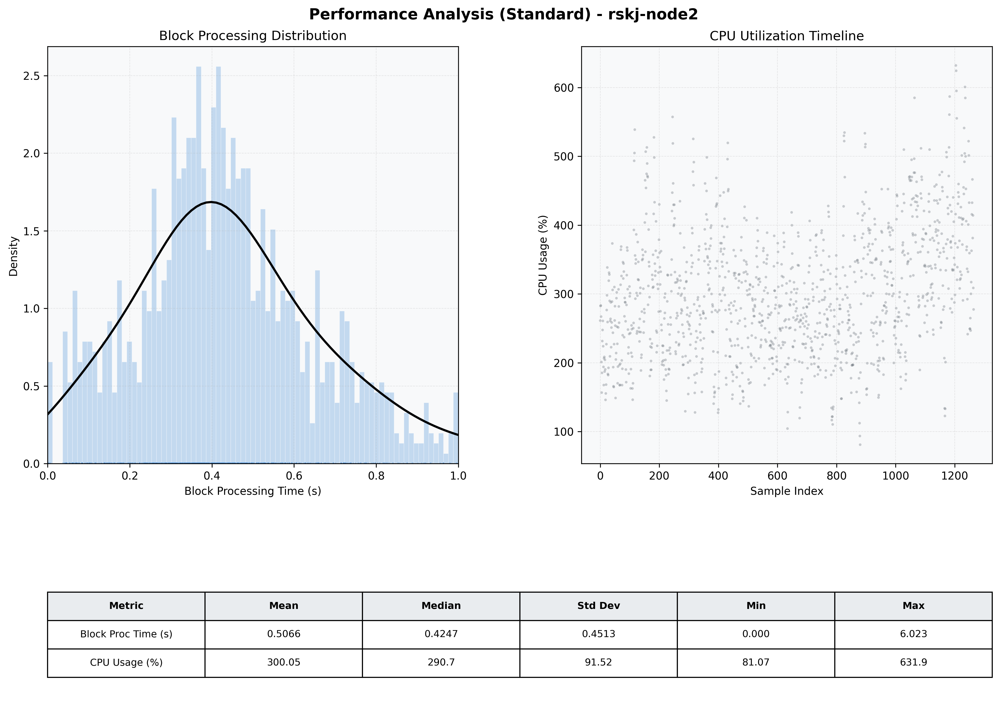

# Node2 Quantitative Performance Report

| Category | Metric | Unit | Mean | Median | Min | Max |
| :--- | :--- | :--- | :--- | :--- | :--- | :--- |
| Processing | Block Processing Time | s | 0.507 | 0.425 | 0.000 | 6.023 |
|  | BlockExecution JMX | s | 0.337 | 0.307 | 0.018 | 0.992 |
| | Gas Consumed (per block) | M units | 6.99 | 6.99 | 5.21 | 6.99 |
| JVM | JVM Heap Used | MiB | 1593.9 | 1583.2 | 180.7 | 2840.2 |
| | JVM Heap Allocated | MiB | 4096.0 | 4096.0 | 4096.0 | 4096.0 |
| JVM GC | GC Copy Time | s | N/A | N/A | N/A | N/A |
| JVM GC | GC MarkSweep Time | s | N/A | N/A | N/A | N/A |
| Disk I/O | Disk Read | MiB/s | 11.451 | 0.000 | 0.000 | 1973.379 |
|  | Disk Write | MiB/s | 140.517 | 89.097 | 0.000 | 10563.696 |
| Network | Received Network Traffic per Container | KiB/s | 58.86 | 56.15 | 13.36 | 123.47 |
|  | Sent Network Traffic per Container | KiB/s | 58.41 | 56.25 | 18.72 | 105.88 |
| Resources | CPU Usage per Container | % | 300.05 | 290.71 | 81.07 | 631.91 |
|  | Memory Usage per Container | MiB | 4320.5 | 4494.1 | 2686.5 | 5585.7 |
| | CPU & Memory Assigned | - | 2.0 CPU, 6G | - | - | - |
| | MALLOC_ARENA_MAX | - | N/A | - | - | - |

