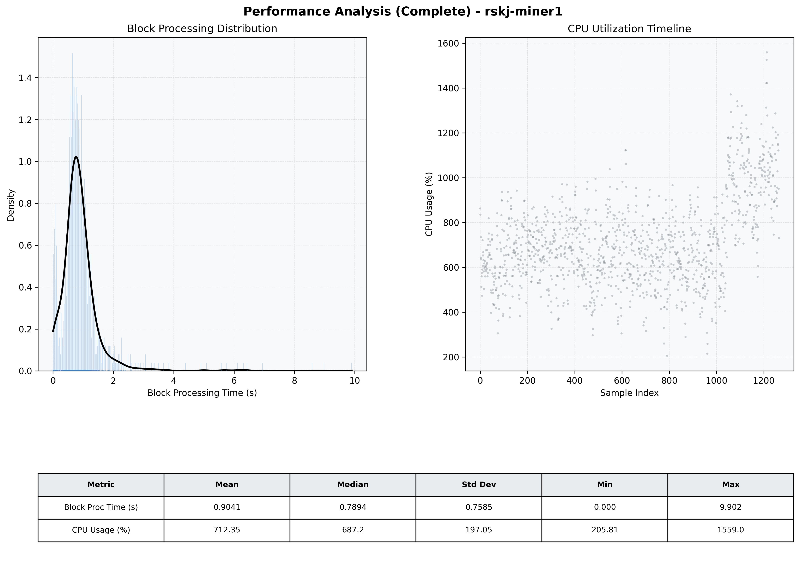

# Miner1 Quantitative Performance Report

| Category | Metric | Unit | Mean | Median | Min | Max |
| :--- | :--- | :--- | :--- | :--- | :--- | :--- |
| Processing | Block Processing Time | s | 0.904 | 0.789 | 0.000 | 9.902 |
|  | BlockExecution JMX | s | 0.847 | 0.722 | 0.071 | 13.294 |
| | Gas Consumed (per block) | M units | 6.99 | 6.99 | 5.21 | 6.99 |
| JVM | JVM Heap Used | MiB | 2990.4 | 3004.9 | 336.2 | 4581.9 |
| | JVM Heap Allocated | MiB | 5120.0 | 5120.0 | 5120.0 | 5120.0 |
| JVM GC | GC Copy Time | s | N/A | N/A | N/A | N/A |
| JVM GC | GC MarkSweep Time | s | N/A | N/A | N/A | N/A |
| Disk I/O | Disk Read | MiB/s | 93.046 | 26.074 | 0.000 | 7108.567 |
|  | Disk Write | MiB/s | 0.002 | 0.002 | 0.000 | 0.009 |
| Network | Received Network Traffic per Container | KiB/s | 57.03 | 54.68 | 16.31 | 118.98 |
|  | Sent Network Traffic per Container | KiB/s | 61.81 | 59.30 | 22.57 | 117.93 |
| Resources | CPU Usage per Container | % | 712.35 | 687.17 | 205.81 | 1559.02 |
|  | Memory Usage per Container | MiB | 7654.0 | 8098.5 | 5579.2 | 8192.0 |
| | CPU & Memory Assigned | - | 4.0 CPU, 8G | - | - | - |
| | MALLOC_ARENA_MAX | - | N/A | - | - | - |

