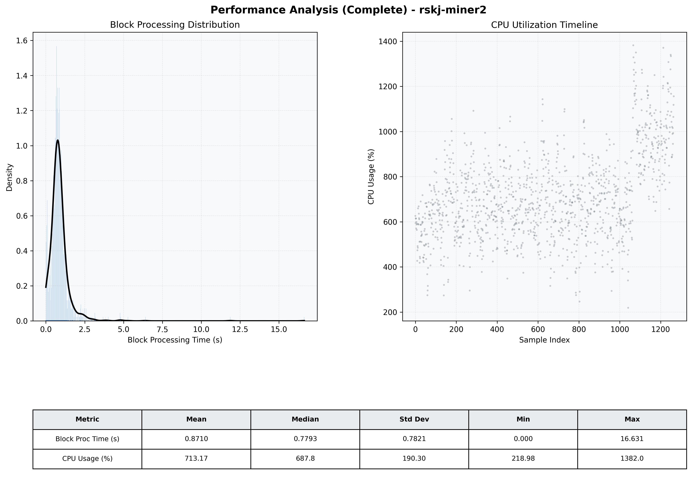

# Miner2 Quantitative Performance Report

| Category | Metric | Unit | Mean | Median | Min | Max |
| :--- | :--- | :--- | :--- | :--- | :--- | :--- |
| Processing | Block Processing Time | s | 0.871 | 0.779 | 0.000 | 16.631 |
|  | BlockExecution JMX | s | 0.801 | 0.696 | 0.068 | 16.442 |
| | Gas Consumed (per block) | M units | 6.99 | 6.99 | 5.21 | 6.99 |
| JVM | JVM Heap Used | MiB | 3001.2 | 3076.2 | 357.2 | 4584.1 |
| | JVM Heap Allocated | MiB | 5120.0 | 5120.0 | 5120.0 | 5120.0 |
| JVM GC | GC Copy Time | s | N/A | N/A | N/A | N/A |
| JVM GC | GC MarkSweep Time | s | N/A | N/A | N/A | N/A |
| Disk I/O | Disk Read | MiB/s | 89.905 | 3.724 | 0.000 | 5265.220 |
|  | Disk Write | MiB/s | 0.002 | 0.002 | 0.000 | 0.011 |
| Network | Received Network Traffic per Container | KiB/s | 57.01 | 54.37 | 15.86 | 119.09 |
|  | Sent Network Traffic per Container | KiB/s | 66.35 | 64.15 | 14.33 | 120.12 |
| Resources | CPU Usage per Container | % | 713.17 | 687.82 | 218.98 | 1381.99 |
|  | Memory Usage per Container | MiB | 7625.3 | 8092.3 | 5618.9 | 8192.0 |
| | CPU & Memory Assigned | - | 4.0 CPU, 8G | - | - | - |
| | MALLOC_ARENA_MAX | - | N/A | - | - | - |

