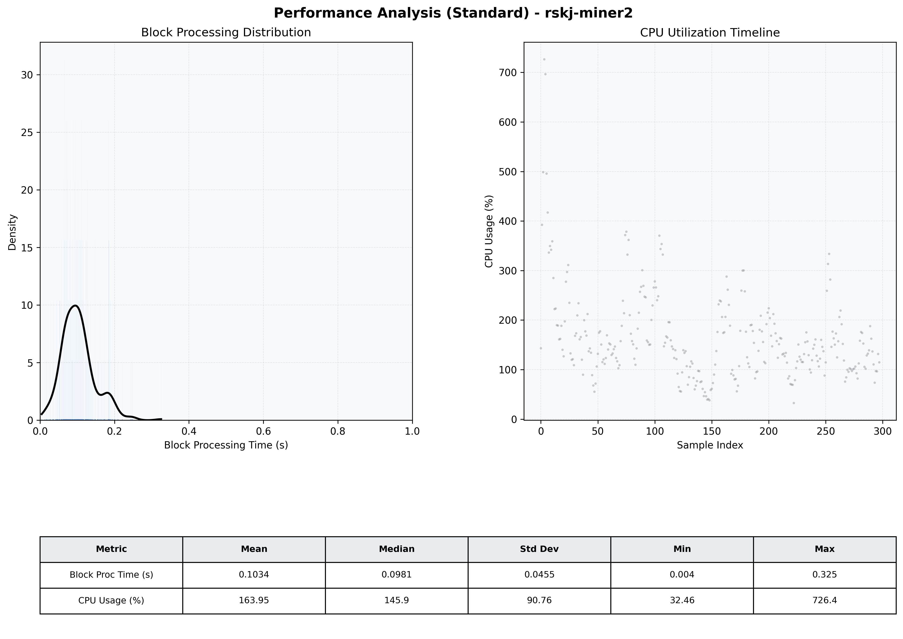

# Miner2 Quantitative Performance Report

| Category | Metric | Unit | Mean | Median | Min | Max |
| :--- | :--- | :--- | :--- | :--- | :--- | :--- |
| Processing | Block Processing Time | s | 0.103 | 0.098 | 0.004 | 0.325 |
|  | BlockExecution JMX | s | 0.060 | 0.053 | 0.009 | 0.184 |
| | Gas Consumed (per block) | M units | 9.05 | 9.61 | 0.00 | 9.96 |
| JVM | JVM Heap Used | MiB | 2078.3 | 2126.1 | 96.1 | 3784.8 |
| | JVM Heap Allocated | MiB | 5120.0 | 5120.0 | 5120.0 | 5120.0 |
| JVM GC | GC Copy Time | s | N/A | N/A | N/A | N/A |
| JVM GC | GC MarkSweep Time | s | N/A | N/A | N/A | N/A |
| Disk I/O | Disk Read | MiB/s | 0.012 | 0.000 | 0.000 | 2.621 |
|  | Disk Write | MiB/s | 632.000 | 445.870 | 0.000 | 7031.515 |
| Network | Received Network Traffic per Container | KiB/s | 112.41 | 99.17 | 1.43 | 381.48 |
|  | Sent Network Traffic per Container | KiB/s | 135.58 | 125.18 | 21.10 | 434.50 |
| Resources | CPU Usage per Container | % | 163.95 | 145.88 | 32.46 | 726.45 |
|  | Memory Usage per Container | MiB | 5357.7 | 5383.2 | 3700.4 | 6709.5 |
| | CPU & Memory Assigned | - | 4.0 CPU, 8G | - | - | - |
| | MALLOC_ARENA_MAX | - | N/A | - | - | - |

