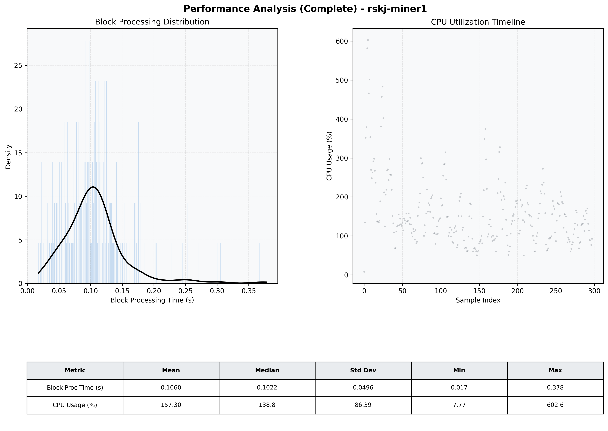

# Miner1 Quantitative Performance Report

| Category | Metric | Unit | Mean | Median | Min | Max |
| :--- | :--- | :--- | :--- | :--- | :--- | :--- |
| Processing | Block Processing Time | s | 0.106 | 0.102 | 0.017 | 0.378 |
|  | BlockExecution JMX | s | 0.063 | 0.058 | 0.011 | 0.289 |
| | Gas Consumed (per block) | M units | 9.05 | 9.61 | 0.00 | 9.96 |
| JVM | JVM Heap Used | MiB | 2232.3 | 2321.6 | 109.0 | 3953.5 |
| | JVM Heap Allocated | MiB | 5120.0 | 5120.0 | 5120.0 | 5120.0 |
| JVM GC | GC Copy Time | s | N/A | N/A | N/A | N/A |
| JVM GC | GC MarkSweep Time | s | N/A | N/A | N/A | N/A |
| Disk I/O | Disk Read | MiB/s | 0.006 | 0.000 | 0.000 | 0.828 |
|  | Disk Write | MiB/s | 703.071 | 553.691 | 0.000 | 6794.290 |
| Network | Received Network Traffic per Container | KiB/s | 117.50 | 109.23 | 11.39 | 358.17 |
|  | Sent Network Traffic per Container | KiB/s | 126.13 | 114.96 | 16.64 | 447.40 |
| Resources | CPU Usage per Container | % | 157.30 | 138.83 | 7.77 | 602.65 |
|  | Memory Usage per Container | MiB | 5382.8 | 5442.2 | 3751.4 | 6653.8 |
| | CPU & Memory Assigned | - | 4.0 CPU, 8G | - | - | - |
| | MALLOC_ARENA_MAX | - | N/A | - | - | - |

