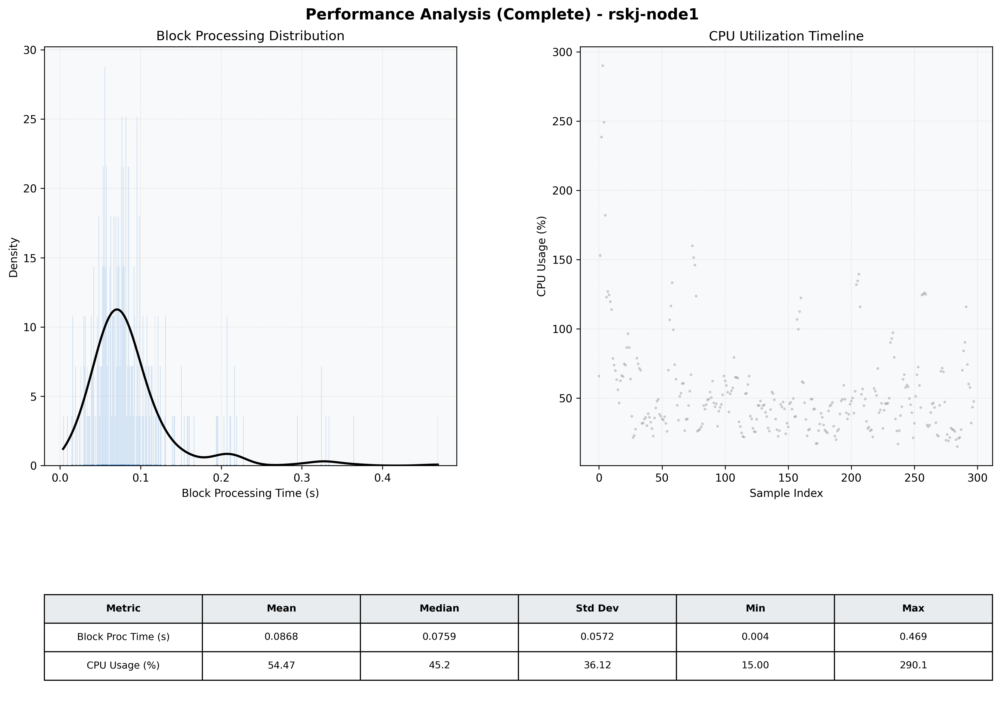

# Node1 Quantitative Performance Report

| Category | Metric | Unit | Mean | Median | Min | Max |
| :--- | :--- | :--- | :--- | :--- | :--- | :--- |
| Processing | Block Processing Time | s | 0.087 | 0.076 | 0.004 | 0.469 |
|  | BlockExecution JMX | s | 0.103 | 0.056 | 0.006 | 10.045 |
| | Gas Consumed (per block) | M units | 9.05 | 9.61 | 0.00 | 9.96 |
| JVM | JVM Heap Used | MiB | 1313.2 | 1262.9 | 37.6 | 2633.1 |
| | JVM Heap Allocated | MiB | 4096.0 | 4096.0 | 4096.0 | 4096.0 |
| JVM GC | GC Copy Time | s | N/A | N/A | N/A | N/A |
| JVM GC | GC MarkSweep Time | s | N/A | N/A | N/A | N/A |
| Disk I/O | Disk Read | MiB/s | 0.005 | 0.000 | 0.000 | 0.828 |
|  | Disk Write | MiB/s | 145.383 | 32.830 | 0.000 | 6804.772 |
| Network | Received Network Traffic per Container | KiB/s | 145.48 | 129.70 | 13.37 | 448.44 |
|  | Sent Network Traffic per Container | KiB/s | 102.47 | 92.70 | 9.61 | 302.34 |
| Resources | CPU Usage per Container | % | 54.47 | 45.25 | 15.00 | 290.06 |
|  | Memory Usage per Container | MiB | 3360.1 | 3420.5 | 939.3 | 4318.0 |
| | CPU & Memory Assigned | - | 2.0 CPU, 6G | - | - | - |
| | MALLOC_ARENA_MAX | - | N/A | - | - | - |

