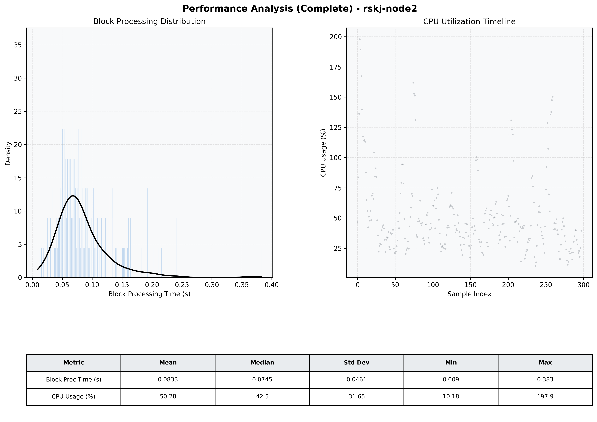

# Node2 Quantitative Performance Report

| Category | Metric | Unit | Mean | Median | Min | Max |
| :--- | :--- | :--- | :--- | :--- | :--- | :--- |
| Processing | Block Processing Time | s | 0.083 | 0.075 | 0.009 | 0.383 |
|  | BlockExecution JMX | s | 0.064 | 0.056 | 0.006 | 0.354 |
| | Gas Consumed (per block) | M units | 9.05 | 9.61 | 0.00 | 9.96 |
| JVM | JVM Heap Used | MiB | 1285.1 | 1280.3 | 41.3 | 2646.3 |
| | JVM Heap Allocated | MiB | 4096.0 | 4096.0 | 4096.0 | 4096.0 |
| JVM GC | GC Copy Time | s | N/A | N/A | N/A | N/A |
| JVM GC | GC MarkSweep Time | s | N/A | N/A | N/A | N/A |
| Disk I/O | Disk Read | MiB/s | 0.004 | 0.000 | 0.000 | 0.828 |
|  | Disk Write | MiB/s | 145.368 | 33.655 | 0.000 | 6803.945 |
| Network | Received Network Traffic per Container | KiB/s | 134.59 | 123.33 | 11.31 | 424.42 |
|  | Sent Network Traffic per Container | KiB/s | 93.56 | 84.83 | 11.55 | 253.95 |
| Resources | CPU Usage per Container | % | 50.28 | 42.54 | 10.18 | 197.93 |
|  | Memory Usage per Container | MiB | 3416.0 | 3516.2 | 783.5 | 4332.7 |
| | CPU & Memory Assigned | - | 2.0 CPU, 6G | - | - | - |
| | MALLOC_ARENA_MAX | - | N/A | - | - | - |

