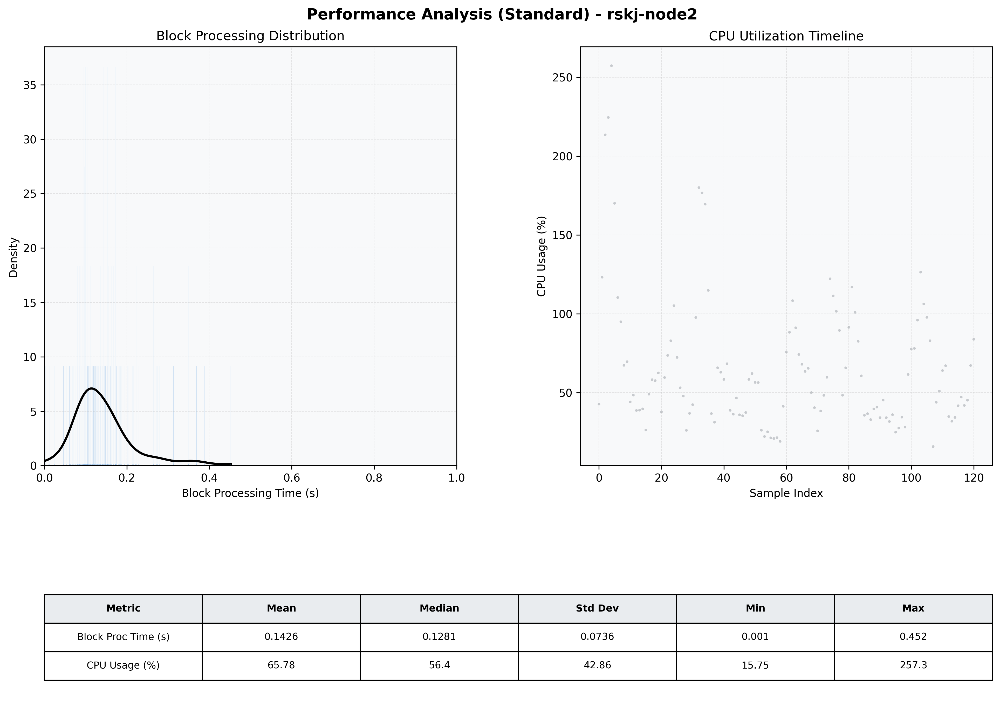

# Node2 Quantitative Performance Report

| Category | Metric | Unit | Mean | Median | Min | Max |
| :--- | :--- | :--- | :--- | :--- | :--- | :--- |
| Processing | Block Processing Time | s | 0.143 | 0.128 | 0.001 | 0.452 |
|  | BlockExecution JMX | s | 0.106 | 0.096 | 0.004 | 0.345 |
| | Gas Consumed (per block) | M units | 15.50 | 16.69 | 0.00 | 16.93 |
| Resources | CPU Usage per Container | % | 65.78 | 56.36 | 15.75 | 257.31 |
|  | Memory Usage per Container | MiB | 2470.5 | 2461.5 | 726.3 | 2920.8 |
| | CPU & Memory Assigned | - | 2.0 CPU, 4G | - | - | - |
| JVM | JVM Heap Used | MiB | 935.4 | 988.5 | 110.7 | 1667.2 |
| | JVM Heap Allocated | MiB | 2048.0 | 2048.0 | 2048.0 | 2048.0 |
| JVM GC | GC Copy Time | s | N/A | N/A | N/A | N/A |
| JVM GC | GC MarkSweep Time | s | N/A | N/A | N/A | N/A |
| Disk I/O | Disk Read | MiB/s | 0.000 | 0.000 | 0.000 | 0.000 |
|  | Disk Write | MiB/s | 182.518 | 57.931 | 1.517 | 4748.888 |
| Network | Received Network Traffic per Container | KiB/s | 201.86 | 186.59 | 1.48 | 514.58 |
|  | Sent Network Traffic per Container | KiB/s | 128.77 | 111.99 | 9.41 | 302.85 |

