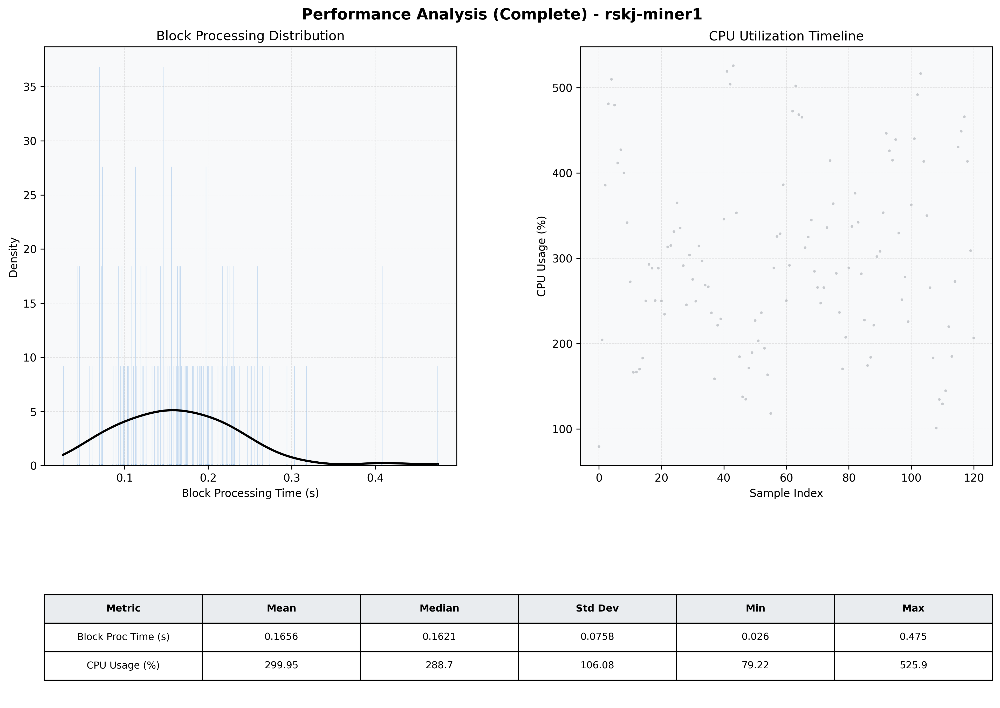

# Miner1 Quantitative Performance Report

| Category | Metric | Unit | Mean | Median | Min | Max |
| :--- | :--- | :--- | :--- | :--- | :--- | :--- |
| Processing | Block Processing Time | s | 0.166 | 0.162 | 0.026 | 0.475 |
|  | BlockExecution JMX | s | 0.104 | 0.095 | 0.012 | 0.399 |
| | Gas Consumed (per block) | M units | 15.50 | 16.69 | 0.00 | 16.93 |
| Resources | CPU Usage per Container | % | 299.95 | 288.67 | 79.22 | 525.86 |
|  | Memory Usage per Container | MiB | 4337.4 | 4329.5 | 1166.7 | 5142.9 |
| | CPU & Memory Assigned | - | 2.0 CPU, 8G | - | - | - |
| JVM | JVM Heap Used | MiB | 1634.2 | 1598.2 | 160.2 | 3105.3 |
| | JVM Heap Allocated | MiB | 4096.0 | 4096.0 | 4096.0 | 4096.0 |
| JVM GC | GC Copy Time | s | N/A | N/A | N/A | N/A |
| JVM GC | GC MarkSweep Time | s | N/A | N/A | N/A | N/A |
| Disk I/O | Disk Read | MiB/s | 0.000 | 0.000 | 0.000 | 0.000 |
|  | Disk Write | MiB/s | 0.001 | 0.001 | 0.000 | 0.006 |
| Network | Received Network Traffic per Container | KiB/s | 164.87 | 141.09 | 2.31 | 432.31 |
|  | Sent Network Traffic per Container | KiB/s | 188.64 | 184.40 | 10.46 | 448.17 |

