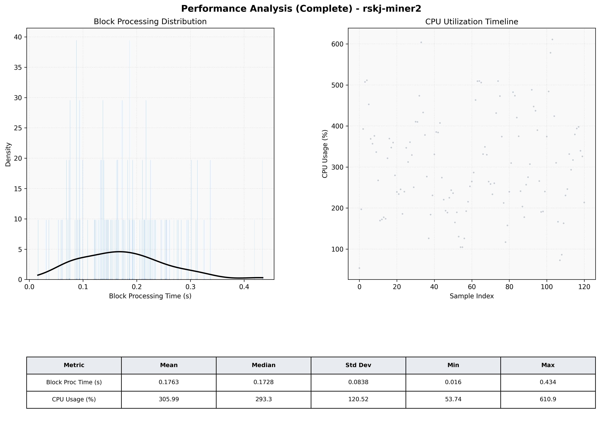

# Miner2 Quantitative Performance Report

| Category | Metric | Unit | Mean | Median | Min | Max |
| :--- | :--- | :--- | :--- | :--- | :--- | :--- |
| Processing | Block Processing Time | s | 0.176 | 0.173 | 0.016 | 0.434 |
|  | BlockExecution JMX | s | 0.106 | 0.103 | 0.011 | 0.296 |
| | Gas Consumed (per block) | M units | 15.50 | 16.69 | 0.00 | 16.93 |
| Resources | CPU Usage per Container | % | 305.99 | 293.32 | 53.74 | 610.87 |
|  | Memory Usage per Container | MiB | 4357.3 | 4370.9 | 1154.9 | 5146.8 |
| | CPU & Memory Assigned | - | 2.0 CPU, 8G | - | - | - |
| JVM | JVM Heap Used | MiB | 1603.0 | 1599.8 | 195.7 | 3098.6 |
| | JVM Heap Allocated | MiB | 4096.0 | 4096.0 | 4096.0 | 4096.0 |
| JVM GC | GC Copy Time | s | N/A | N/A | N/A | N/A |
| JVM GC | GC MarkSweep Time | s | N/A | N/A | N/A | N/A |
| Disk I/O | Disk Read | MiB/s | 0.000 | 0.000 | 0.000 | 0.000 |
|  | Disk Write | MiB/s | 0.001 | 0.001 | 0.000 | 0.006 |
| Network | Received Network Traffic per Container | KiB/s | 161.45 | 145.85 | 1.83 | 403.27 |
|  | Sent Network Traffic per Container | KiB/s | 197.54 | 189.77 | 9.87 | 528.99 |

