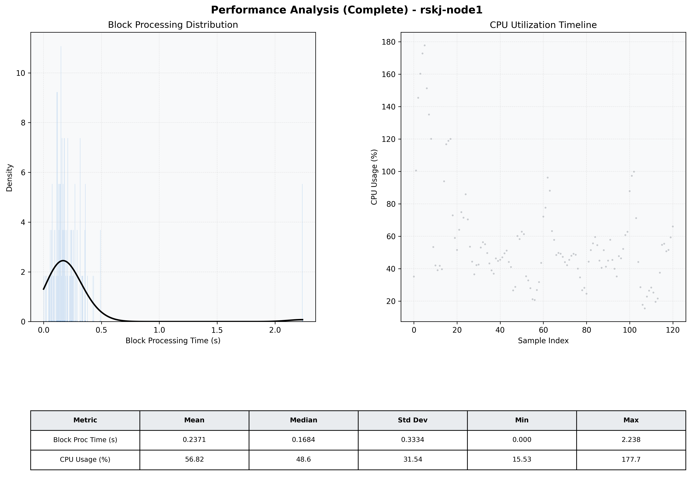

# Node1 Quantitative Performance Report

| Category | Metric | Unit | Mean | Median | Min | Max |
| :--- | :--- | :--- | :--- | :--- | :--- | :--- |
| Processing | Block Processing Time | s | 0.237 | 0.168 | 0.000 | 2.238 |
|  | BlockExecution JMX | s | 0.199 | 0.128 | 0.010 | 2.119 |
| | Gas Consumed (per block) | M units | 15.50 | 16.69 | 0.00 | 16.93 |
| Resources | CPU Usage per Container | % | 56.82 | 48.61 | 15.53 | 177.70 |
|  | Memory Usage per Container | MiB | 1647.7 | 1635.8 | 990.9 | 2188.2 |
| | CPU & Memory Assigned | - | 1.0 CPU, 4G | - | - | - |
| JVM | JVM Heap Used | MiB | 598.4 | 575.4 | 84.7 | 1126.1 |
| | JVM Heap Allocated | MiB | 1979.8 | 1979.8 | 1979.8 | 1979.8 |
| JVM GC | GC Copy Time | s | 0.0044 | 0.0038 | 0.000 | 0.011 |
| JVM GC | GC MarkSweep Time | s | 0.0000 | 0.0000 | 0.000 | 0.000 |
| Disk I/O | Disk Read | MiB/s | 0.005 | 0.000 | 0.000 | 0.550 |
|  | Disk Write | MiB/s | 204.639 | 56.830 | 1.517 | 4752.060 |
| Network | Received Network Traffic per Container | KiB/s | 193.42 | 185.65 | 1.49 | 515.99 |
|  | Sent Network Traffic per Container | KiB/s | 144.48 | 130.66 | 9.31 | 368.08 |

