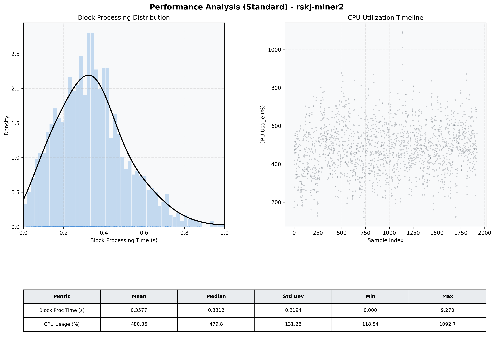

# Miner2 Quantitative Performance Report

| Category | Metric | Unit | Mean | Median | Min | Max |
| :--- | :--- | :--- | :--- | :--- | :--- | :--- |
| Processing | Block Processing Time | s | 0.358 | 0.331 | 0.000 | 9.270 |
|  | BlockExecution JMX | s | 0.216 | 0.196 | 0.013 | 0.969 |
| | Gas Consumed (per block) | M units | 21.33 | 24.50 | 0.04 | 24.98 |
| Resources | CPU Usage per Container | % | 480.36 | 479.80 | 118.84 | 1092.75 |
|  | Memory Usage per Container | MiB | 9451.7 | 10006.7 | 5405.8 | 10240.0 |
| | CPU & Memory Assigned | - | 2.0 CPU, 8G | - | - | - |
| JVM | JVM Heap Used | MiB | 2742.0 | 2760.0 | 1257.1 | 3699.5 |
| | JVM Heap Allocated | MiB | 4096.0 | 4096.0 | 4096.0 | 4096.0 |
| JVM GC | GC Copy Time | s | N/A | N/A | N/A | N/A |
| JVM GC | GC MarkSweep Time | s | N/A | N/A | N/A | N/A |
| Disk I/O | Disk Read | MiB/s | 330.329 | 11.585 | 0.000 | 26476.309 |
|  | Disk Write | MiB/s | 0.002 | 0.001 | 0.000 | 0.037 |
| Network | Received Network Traffic per Container | KiB/s | 165.80 | 152.83 | 1.19 | 687.34 |
|  | Sent Network Traffic per Container | KiB/s | 162.93 | 125.89 | 9.50 | 799.44 |

