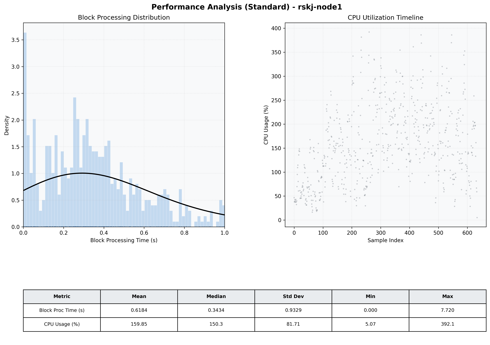

# Node1 Quantitative Performance Report

| Category | Metric | Unit | Mean | Median | Min | Max |
| :--- | :--- | :--- | :--- | :--- | :--- | :--- |
| Processing | Block Processing Time | s | 0.618 | 0.343 | 0.000 | 7.720 |
|  | BlockExecution JMX | s | 0.248 | 0.209 | 0.009 | 0.979 |
| | Gas Consumed (per block) | M units | 21.33 | 24.50 | 0.04 | 24.98 |
| Resources | CPU Usage per Container | % | 159.85 | 150.30 | 5.07 | 392.09 |
|  | Memory Usage per Container | MiB | 3799.8 | 3958.1 | 2456.5 | 4096.0 |
| | CPU & Memory Assigned | - | 1.0 CPU, 4G | - | - | - |
| JVM | JVM Heap Used | MiB | 1713.7 | 1746.7 | 954.6 | 1978.0 |
| | JVM Heap Allocated | MiB | 1979.8 | 1979.8 | 1979.8 | 1979.8 |
| JVM GC | GC Copy Time | s | 0.0007 | 0.0000 | 0.000 | 0.029 |
| JVM GC | GC MarkSweep Time | s | 0.0779 | 0.0720 | 0.000 | 0.500 |
| Disk I/O | Disk Read | MiB/s | 361.713 | 42.414 | 0.000 | 14296.506 |
|  | Disk Write | MiB/s | 819.426 | 94.427 | 0.552 | 22494.017 |
| Network | Received Network Traffic per Container | KiB/s | 269.23 | 254.96 | 1.89 | 1025.43 |
|  | Sent Network Traffic per Container | KiB/s | 176.35 | 163.80 | 10.88 | 546.85 |

