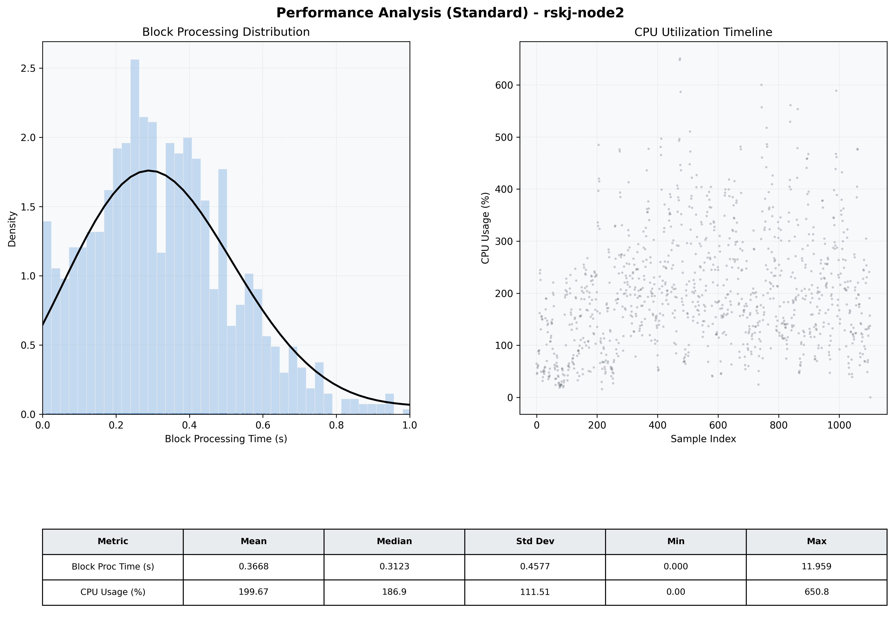

# Node2 Quantitative Performance Report

| Category | Metric | Unit | Mean | Median | Min | Max |
| :--- | :--- | :--- | :--- | :--- | :--- | :--- |
| Processing | Block Processing Time | s | 0.367 | 0.312 | 0.000 | 11.959 |
|  | BlockExecution JMX | s | 0.209 | 0.180 | 0.007 | 0.927 |
| | Gas Consumed (per block) | M units | 21.33 | 24.50 | 0.04 | 24.98 |
| Resources | CPU Usage per Container | % | 199.67 | 186.90 | 0.00 | 650.83 |
|  | Memory Usage per Container | MiB | 3963.0 | 4039.5 | 3065.0 | 4096.0 |
| | CPU & Memory Assigned | - | 2.0 CPU, 4G | - | - | - |
| JVM | JVM Heap Used | MiB | 1803.8 | 1818.8 | 1006.1 | 2026.7 |
| | JVM Heap Allocated | MiB | 2048.0 | 2048.0 | 2048.0 | 2048.0 |
| JVM GC | GC Copy Time | s | N/A | N/A | N/A | N/A |
| JVM GC | GC MarkSweep Time | s | N/A | N/A | N/A | N/A |
| Disk I/O | Disk Read | MiB/s | 564.301 | 106.490 | 0.000 | 29334.529 |
|  | Disk Write | MiB/s | 933.479 | 94.903 | 0.000 | 44459.417 |
| Network | Received Network Traffic per Container | KiB/s | 251.85 | 241.28 | 0.00 | 878.47 |
|  | Sent Network Traffic per Container | KiB/s | 145.62 | 133.54 | 0.00 | 577.21 |

