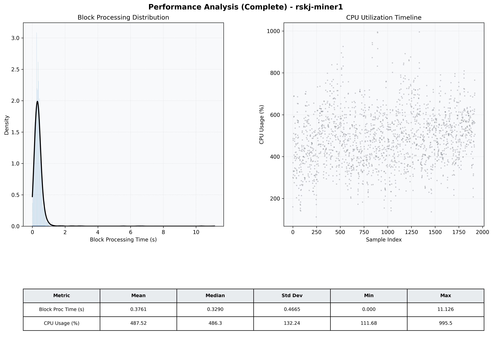

# Miner1 Quantitative Performance Report

| Category | Metric | Unit | Mean | Median | Min | Max |
| :--- | :--- | :--- | :--- | :--- | :--- | :--- |
| Processing | Block Processing Time | s | 0.376 | 0.329 | 0.000 | 11.126 |
|  | BlockExecution JMX | s | 0.238 | 0.195 | 0.014 | 10.129 |
| | Gas Consumed (per block) | M units | 21.33 | 24.50 | 0.04 | 24.98 |
| Resources | CPU Usage per Container | % | 487.52 | 486.34 | 111.68 | 995.54 |
|  | Memory Usage per Container | MiB | 9427.5 | 9992.6 | 5462.0 | 10240.0 |
| | CPU & Memory Assigned | - | 2.0 CPU, 8G | - | - | - |
| JVM | JVM Heap Used | MiB | 2706.2 | 2688.2 | 1321.7 | 3685.6 |
| | JVM Heap Allocated | MiB | 4096.0 | 4096.0 | 4096.0 | 4096.0 |
| JVM GC | GC Copy Time | s | N/A | N/A | N/A | N/A |
| JVM GC | GC MarkSweep Time | s | N/A | N/A | N/A | N/A |
| Disk I/O | Disk Read | MiB/s | 342.214 | 6.345 | 0.000 | 26110.904 |
|  | Disk Write | MiB/s | 0.002 | 0.001 | 0.000 | 0.033 |
| Network | Received Network Traffic per Container | KiB/s | 185.59 | 173.36 | 2.00 | 750.05 |
|  | Sent Network Traffic per Container | KiB/s | 172.11 | 147.29 | 10.95 | 883.68 |

