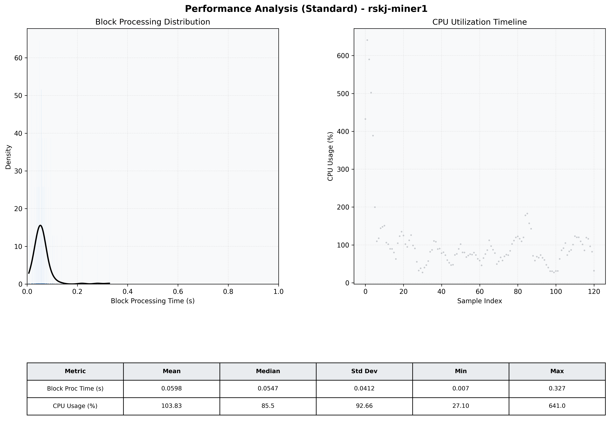

# Miner1 Quantitative Performance Report

| Category | Metric | Unit | Mean | Median | Min | Max |
| :--- | :--- | :--- | :--- | :--- | :--- | :--- |
| Processing | Block Processing Time | s | 0.060 | 0.055 | 0.007 | 0.327 |
|  | BlockExecution JMX | s | 0.038 | 0.033 | 0.002 | 0.277 |
| | Gas Consumed (per block) | M units | 6.04 | 6.39 | 0.04 | 6.96 |
| JVM | JVM Heap Used | MiB | 1121.9 | 1156.1 | 80.2 | 2674.1 |
| | JVM Heap Allocated | MiB | 3292.0 | 3072.0 | 3072.0 | 5120.0 |
| JVM GC | GC Copy Time | s | N/A | N/A | N/A | N/A |
| JVM GC | GC MarkSweep Time | s | N/A | N/A | N/A | N/A |
| Disk I/O | Disk Read | MiB/s | 0.010 | 0.000 | 0.000 | 1.103 |
|  | Disk Write | MiB/s | 377.418 | 260.543 | 0.717 | 2407.696 |
| Network | Received Network Traffic per Container | KiB/s | 83.42 | 79.82 | 1.86 | 235.74 |
|  | Sent Network Traffic per Container | KiB/s | 101.25 | 97.80 | 6.09 | 283.46 |
| Resources | CPU Usage per Container | % | 103.83 | 85.46 | 27.10 | 640.97 |
|  | Memory Usage per Container | MiB | 3379.1 | 3882.9 | 1195.6 | 4205.3 |
| | CPU & Memory Assigned | - | 4.0 CPU, 8G | - | - | - |
| | MALLOC_ARENA_MAX | - | N/A | - | - | - |

