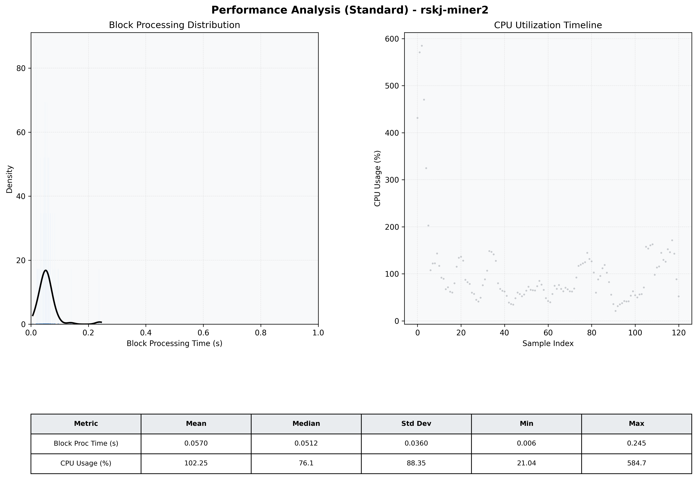

# Miner2 Quantitative Performance Report

| Category | Metric | Unit | Mean | Median | Min | Max |
| :--- | :--- | :--- | :--- | :--- | :--- | :--- |
| Processing | Block Processing Time | s | 0.057 | 0.051 | 0.006 | 0.245 |
|  | BlockExecution JMX | s | 0.041 | 0.029 | 0.003 | 0.801 |
| | Gas Consumed (per block) | M units | 6.04 | 6.39 | 0.04 | 6.96 |
| JVM | JVM Heap Used | MiB | 1167.4 | 1110.8 | 93.9 | 2716.4 |
| | JVM Heap Allocated | MiB | 3292.0 | 3072.0 | 3072.0 | 5120.0 |
| JVM GC | GC Copy Time | s | N/A | N/A | N/A | N/A |
| JVM GC | GC MarkSweep Time | s | N/A | N/A | N/A | N/A |
| Disk I/O | Disk Read | MiB/s | 0.000 | 0.000 | 0.000 | 0.000 |
|  | Disk Write | MiB/s | 318.572 | 229.233 | 0.860 | 2392.638 |
| Network | Received Network Traffic per Container | KiB/s | 84.57 | 82.42 | 0.69 | 177.60 |
|  | Sent Network Traffic per Container | KiB/s | 95.95 | 90.28 | 4.65 | 216.28 |
| Resources | CPU Usage per Container | % | 102.25 | 76.13 | 21.04 | 584.75 |
|  | Memory Usage per Container | MiB | 3181.2 | 3213.1 | 0.0 | 3444.8 |
| | CPU & Memory Assigned | - | 4.0 CPU, 8G | - | - | - |
| | MALLOC_ARENA_MAX | - | N/A | - | - | - |

