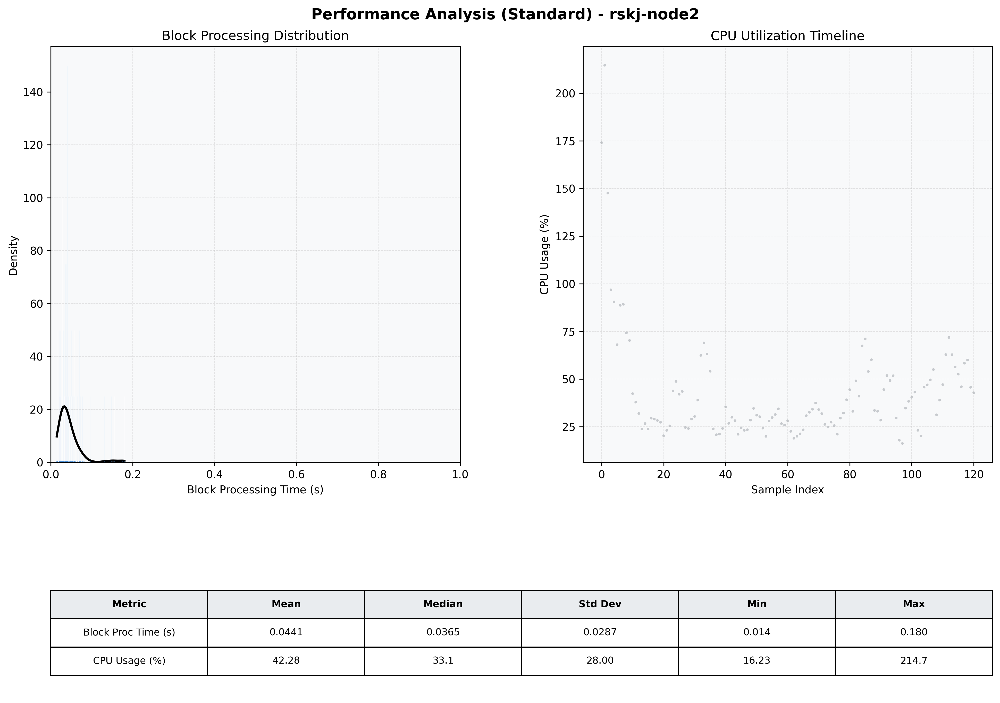

# Node2 Quantitative Performance Report

| Category | Metric | Unit | Mean | Median | Min | Max |
| :--- | :--- | :--- | :--- | :--- | :--- | :--- |
| Processing | Block Processing Time | s | 0.044 | 0.036 | 0.014 | 0.180 |
|  | BlockExecution JMX | s | 0.036 | 0.028 | 0.000 | 0.427 |
| | Gas Consumed (per block) | M units | 6.04 | 6.39 | 0.04 | 6.96 |
| JVM | JVM Heap Used | MiB | 669.2 | 610.8 | 64.2 | 1411.6 |
| | JVM Heap Allocated | MiB | 2268.0 | 2048.0 | 2048.0 | 4096.0 |
| JVM GC | GC Copy Time | s | N/A | N/A | N/A | N/A |
| JVM GC | GC MarkSweep Time | s | N/A | N/A | N/A | N/A |
| Disk I/O | Disk Read | MiB/s | 0.000 | 0.000 | 0.000 | 0.000 |
|  | Disk Write | MiB/s | 53.205 | 27.033 | 0.717 | 1355.355 |
| Network | Received Network Traffic per Container | KiB/s | 104.47 | 97.78 | 0.77 | 235.71 |
|  | Sent Network Traffic per Container | KiB/s | 69.13 | 64.63 | 5.26 | 151.87 |
| Resources | CPU Usage per Container | % | 42.28 | 33.12 | 16.23 | 214.73 |
|  | Memory Usage per Container | MiB | 1282.1 | 1377.0 | 693.6 | 1558.5 |
| | CPU & Memory Assigned | - | 2.0 CPU, 6G | - | - | - |
| | MALLOC_ARENA_MAX | - | N/A | - | - | - |

