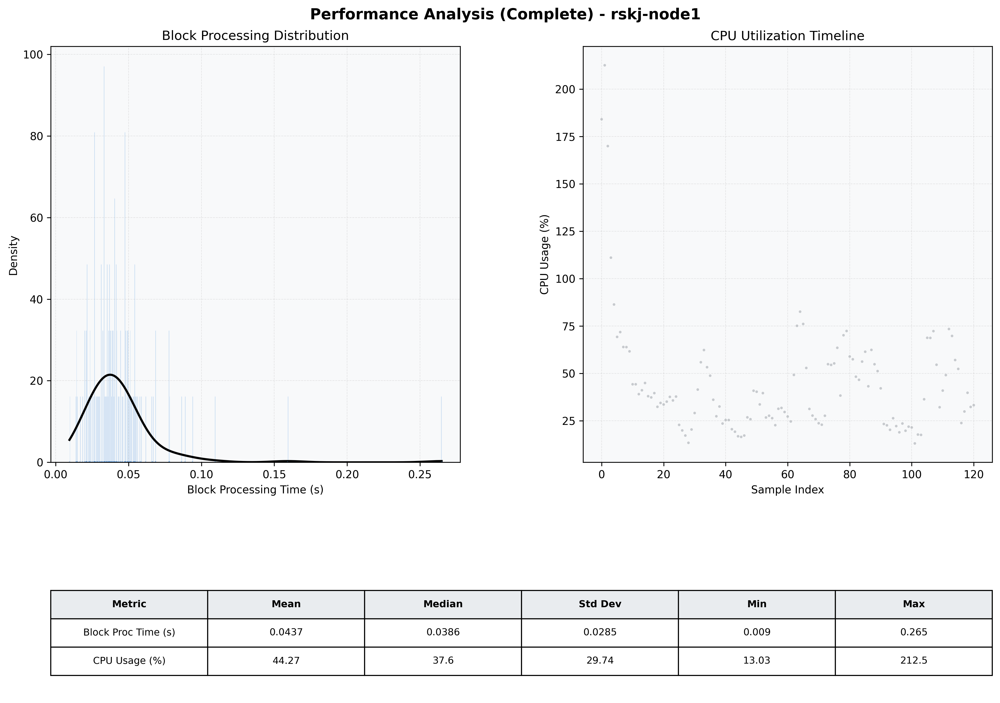

# Node1 Quantitative Performance Report

| Category | Metric | Unit | Mean | Median | Min | Max |
| :--- | :--- | :--- | :--- | :--- | :--- | :--- |
| Processing | Block Processing Time | s | 0.044 | 0.039 | 0.009 | 0.265 |
|  | BlockExecution JMX | s | 0.037 | 0.030 | 0.000 | 0.524 |
| | Gas Consumed (per block) | M units | 6.04 | 6.39 | 0.04 | 6.96 |
| JVM | JVM Heap Used | MiB | 766.5 | 762.6 | 78.2 | 1735.1 |
| | JVM Heap Allocated | MiB | 2268.0 | 2048.0 | 2048.0 | 4096.0 |
| JVM GC | GC Copy Time | s | N/A | N/A | N/A | N/A |
| JVM GC | GC MarkSweep Time | s | N/A | N/A | N/A | N/A |
| Disk I/O | Disk Read | MiB/s | 0.000 | 0.000 | 0.000 | 0.000 |
|  | Disk Write | MiB/s | 53.461 | 26.897 | 0.717 | 1356.044 |
| Network | Received Network Traffic per Container | KiB/s | 110.78 | 100.20 | 0.71 | 254.24 |
|  | Sent Network Traffic per Container | KiB/s | 78.56 | 64.74 | 4.94 | 179.91 |
| Resources | CPU Usage per Container | % | 44.27 | 37.59 | 13.03 | 212.53 |
|  | Memory Usage per Container | MiB | 2028.2 | 2061.5 | 0.0 | 2262.2 |
| | CPU & Memory Assigned | - | 2.0 CPU, 6G | - | - | - |
| | MALLOC_ARENA_MAX | - | N/A | - | - | - |

