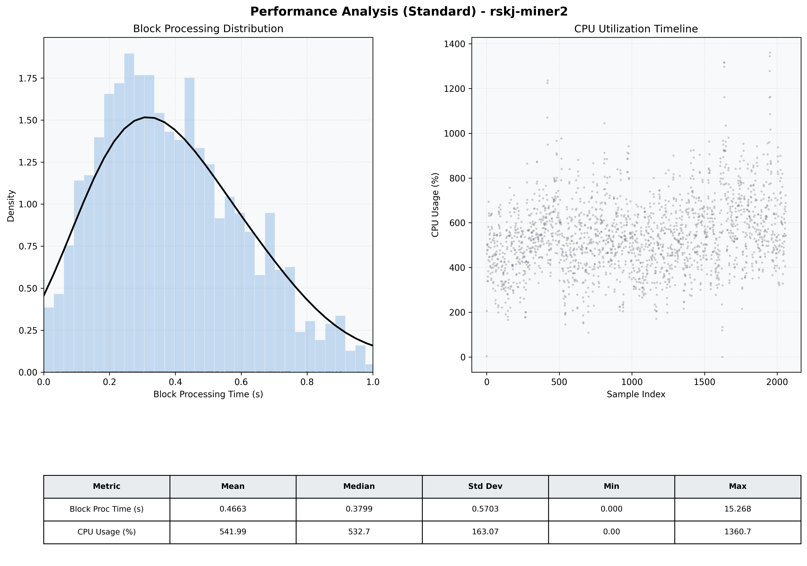

# Miner2 Quantitative Performance Report

| Category | Metric | Unit | Mean | Median | Min | Max |
| :--- | :--- | :--- | :--- | :--- | :--- | :--- |
| Processing | Block Processing Time | s | 0.466 | 0.380 | 0.000 | 15.268 |
|  | BlockExecution JMX | s | 0.260 | 0.213 | 0.000 | 1.000 |
| | Gas Consumed (per block) | M units | 20.85 | 24.34 | 0.00 | 24.98 |
| Resources | CPU Usage per Container | % | 541.99 | 532.72 | 0.00 | 1360.75 |
|  | Memory Usage per Container | MiB | 7597.9 | 7984.4 | 781.2 | 8192.0 |
| | CPU & Memory Assigned | - | 2.0 CPU, 8G | - | - | - |
| JVM | JVM Heap Used | MiB | 2676.4 | 2689.6 | 36.9 | 3727.9 |
| | JVM Heap Allocated | MiB | 4096.0 | 4096.0 | 4096.0 | 4096.0 |
| JVM GC | GC Copy Time | s | N/A | N/A | N/A | N/A |
| JVM GC | GC MarkSweep Time | s | N/A | N/A | N/A | N/A |
| Disk I/O | Disk Read | MiB/s | 433.617 | 53.365 | 0.000 | 30433.601 |
|  | Disk Write | MiB/s | 0.002 | 0.001 | 0.000 | 0.041 |
| Network | Received Network Traffic per Container | KiB/s | 218.37 | 204.02 | 0.00 | 2294.76 |
|  | Sent Network Traffic per Container | KiB/s | 268.09 | 254.35 | 0.00 | 1104.08 |

