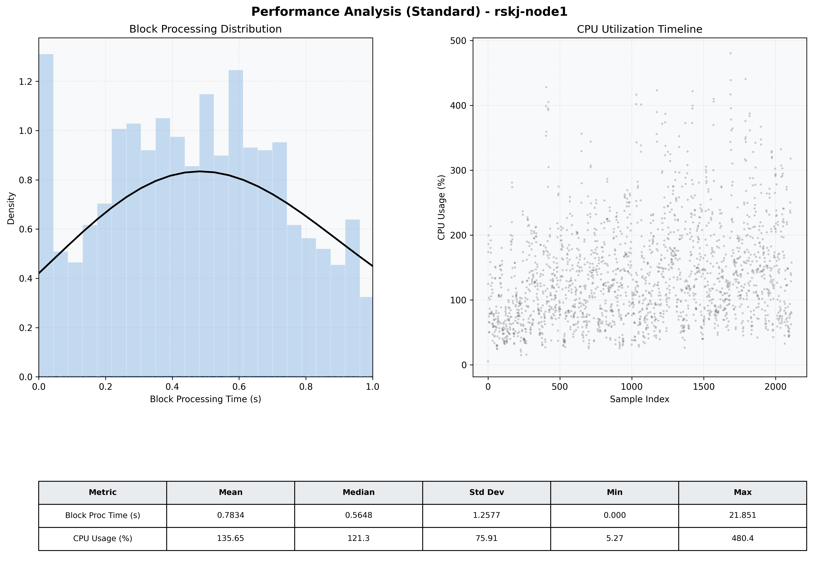

# Node1 Quantitative Performance Report

| Category | Metric | Unit | Mean | Median | Min | Max |
| :--- | :--- | :--- | :--- | :--- | :--- | :--- |
| Processing | Block Processing Time | s | 0.783 | 0.565 | 0.000 | 21.851 |
|  | BlockExecution JMX | s | 0.353 | 0.317 | 0.000 | 0.999 |
| | Gas Consumed (per block) | M units | 20.85 | 24.34 | 0.00 | 24.98 |
| Resources | CPU Usage per Container | % | 135.65 | 121.29 | 5.27 | 480.45 |
|  | Memory Usage per Container | MiB | 5437.7 | 5856.8 | 652.0 | 6144.0 |
| | CPU & Memory Assigned | - | 1.0 CPU, 4G | - | - | - |
| JVM | JVM Heap Used | MiB | 2604.9 | 2693.7 | 160.3 | 3851.0 |
| | JVM Heap Allocated | MiB | 3959.5 | 3959.5 | 3959.5 | 3959.5 |
| JVM GC | GC Copy Time | s | 0.0227 | 0.0172 | 0.000 | 0.227 |
| JVM GC | GC MarkSweep Time | s | 0.0002 | 0.0000 | 0.000 | 0.499 |
| Disk I/O | Disk Read | MiB/s | 371.402 | 50.756 | 0.000 | 23764.682 |
|  | Disk Write | MiB/s | 960.422 | 90.139 | 0.000 | 26600.366 |
| Network | Received Network Traffic per Container | KiB/s | 277.46 | 261.49 | 0.64 | 1565.83 |
|  | Sent Network Traffic per Container | KiB/s | 179.63 | 169.36 | 0.13 | 747.58 |

