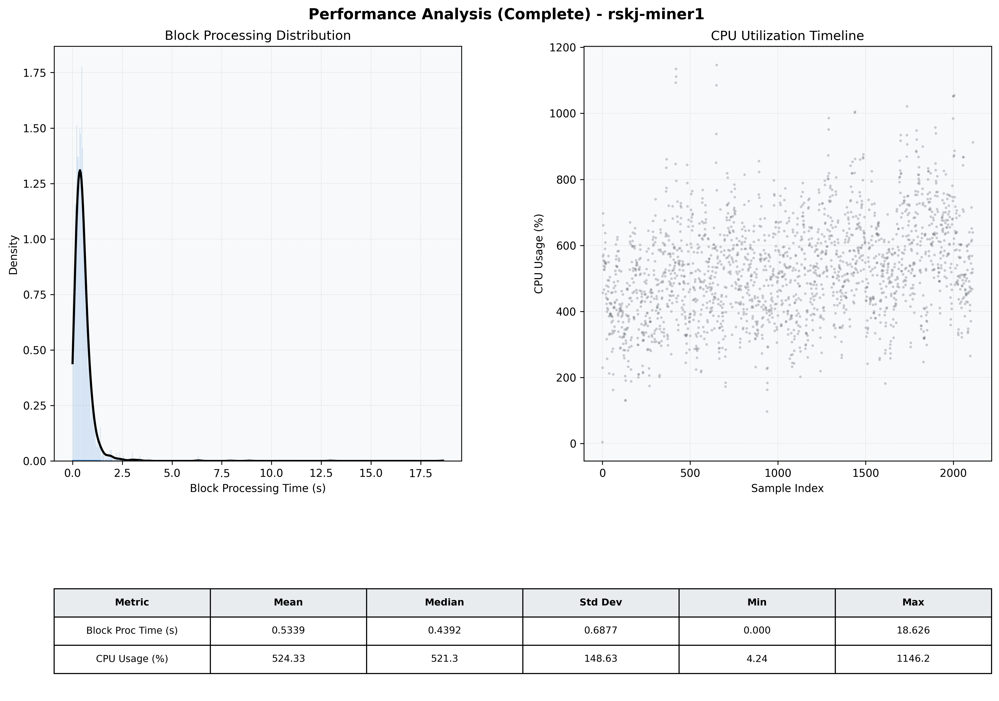

# Miner1 Quantitative Performance Report

| Category | Metric | Unit | Mean | Median | Min | Max |
| :--- | :--- | :--- | :--- | :--- | :--- | :--- |
| Processing | Block Processing Time | s | 0.534 | 0.439 | 0.000 | 18.626 |
|  | BlockExecution JMX | s | 0.325 | 0.247 | 0.014 | 11.318 |
| | Gas Consumed (per block) | M units | 20.85 | 24.34 | 0.00 | 24.98 |
| Resources | CPU Usage per Container | % | 524.33 | 521.34 | 4.24 | 1146.17 |
|  | Memory Usage per Container | MiB | 7851.2 | 8121.4 | 840.3 | 8192.0 |
| | CPU & Memory Assigned | - | 2.0 CPU, 8G | - | - | - |
| JVM | JVM Heap Used | MiB | 3398.7 | 3307.8 | 127.4 | 5487.2 |
| | JVM Heap Allocated | MiB | 6144.0 | 6144.0 | 6144.0 | 6144.0 |
| JVM GC | GC Copy Time | s | N/A | N/A | N/A | N/A |
| JVM GC | GC MarkSweep Time | s | N/A | N/A | N/A | N/A |
| Disk I/O | Disk Read | MiB/s | 969.532 | 137.441 | 0.000 | 32693.733 |
|  | Disk Write | MiB/s | 0.002 | 0.001 | 0.000 | 0.038 |
| Network | Received Network Traffic per Container | KiB/s | 214.55 | 200.31 | 0.73 | 1402.19 |
|  | Sent Network Traffic per Container | KiB/s | 255.58 | 243.15 | 5.06 | 2330.34 |

