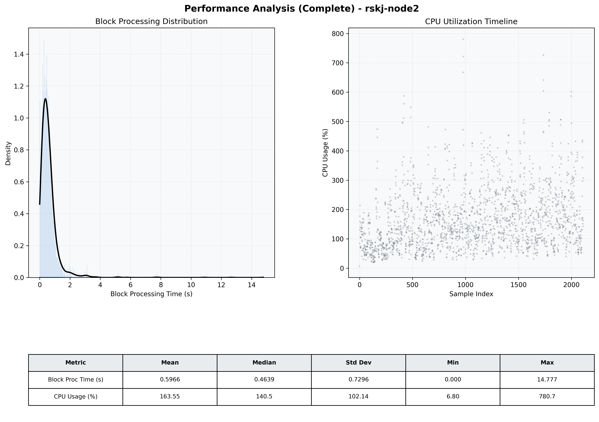

# Node2 Quantitative Performance Report

| Category | Metric | Unit | Mean | Median | Min | Max |
| :--- | :--- | :--- | :--- | :--- | :--- | :--- |
| Processing | Block Processing Time | s | 0.597 | 0.464 | 0.000 | 14.777 |
|  | BlockExecution JMX | s | 0.409 | 0.296 | 0.000 | 13.998 |
| | Gas Consumed (per block) | M units | 20.85 | 24.34 | 0.00 | 24.98 |
| Resources | CPU Usage per Container | % | 163.55 | 140.49 | 6.80 | 780.66 |
|  | Memory Usage per Container | MiB | 5622.2 | 5915.1 | 657.6 | 6144.0 |
| | CPU & Memory Assigned | - | 2.0 CPU, 4G | - | - | - |
| JVM | JVM Heap Used | MiB | 2357.7 | 2381.1 | 92.0 | 3605.7 |
| | JVM Heap Allocated | MiB | 4096.0 | 4096.0 | 4096.0 | 4096.0 |
| JVM GC | GC Copy Time | s | N/A | N/A | N/A | N/A |
| JVM GC | GC MarkSweep Time | s | N/A | N/A | N/A | N/A |
| Disk I/O | Disk Read | MiB/s | 435.160 | 70.914 | 0.000 | 40765.189 |
|  | Disk Write | MiB/s | 933.017 | 86.412 | 0.000 | 47806.496 |
| Network | Received Network Traffic per Container | KiB/s | 266.71 | 254.95 | 0.64 | 1536.22 |
|  | Sent Network Traffic per Container | KiB/s | 180.37 | 168.17 | 4.67 | 698.93 |

