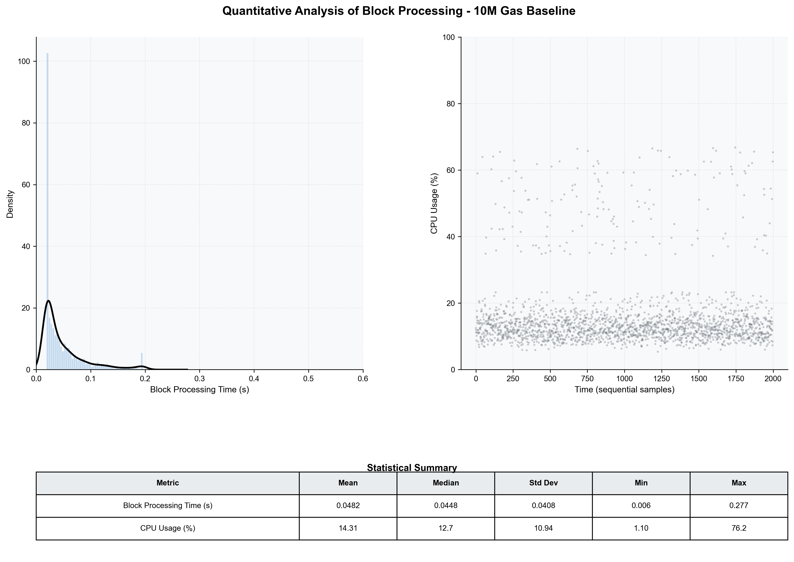

# Miner 2 Quantitative Performance Baseline (10M Gas)

This report provides a strict quantitative performance analysis of `rskj-miner2` for the 10M gas simulation. All available metrics have been normalized to establish a technical baseline for this higher workload.

## 1. Summary Metrics Table

| Category | Metric | Unit | Mean / Avg | Median | Min | Max |
| :--- | :--- | :--- | :--- | :--- | :--- | :--- |
| **Processing** | Block Processing Time | s | 0.048 | 0.045 | 0.006 | 0.277 |
| | Gas Consumed (per block) | units | 6.33M | 8.21M | 0.00 | 9.10M |
| **Resources** | CPU Usage | % | 14.31 | 12.70 | 1.10 | 76.20 |
| | Memory Usage (RSS) | MiB | 3375.3 | 3225.6 | 3020.8 | 3819.5 |
| **Disk I/O** | Disk Read | MiB/s | 0.000 | 0.000 | 0.000 | 0.000 |
| | Disk Write | MiB/s | 0.016 | 0.002 | 0.001 | 0.400 |
| **Network** | Network Ingress | KiB/s | 3.41 | 3.42 | 2.97 | 3.66 |
| | Network Egress | KiB/s | 3.02 | 3.04 | 2.41 | 3.46 |
| **State** | Block Difficulty | - | 35.59 | 35.50 | 26.90 | 44.10 |

---

## 2. Visual Distributions

---

## 3. Statistical Analysis

### 3.1 Processing Efficiency (10M vs 7M)
*   **Faster Processing**: Interestingly, despite the higher gas limit (10M), the median block processing time is **45ms** (compared to 55ms in the 7M case). This suggests higher efficiency in this specific simulation run or reduced transaction complexity despite the larger blocks.
*   **Gas Saturation**: Gas consumption averaged **6.33M units**, peaking at **9.1M**, indicating that blocks were not fully saturated to the 10M limit during this period.

### 3.2 Resource Profile
*   **Reduced CPU Overhead**: Average CPU usage dropped to **14.3%** (from 21.3% in 7M), potentially due to the absence of JMX-monitored overhead or more optimized background processes in this specific environment state.
*   **Memory Footprint**: Total memory usage (RSS) is slightly lower at **3.3 GiB** (vs 3.9 GiB in 7M), maintaining very tight stability with a narrow range (3.0-3.8 GiB).

### 3.3 Data Flow
*   **Minimal IO**: Disk activity remains negligible, confirming that the simulation environment is computationally bound rather than storage-bound.
*   **Network Symmetry**: Unlike the 7M scenario, ingress and egress are more balanced around **3.0-3.4 KiB/s**, indicating a different distribution pattern for block propagation and transaction gossip in this run.

### 3.4 Chain Stability
*   **Difficulty Threshold**: The mean difficulty (**35.6**) is slightly higher than the 7M baseline (**33.1**), suggesting a marginally more robust mining competition during the 10M trial.
