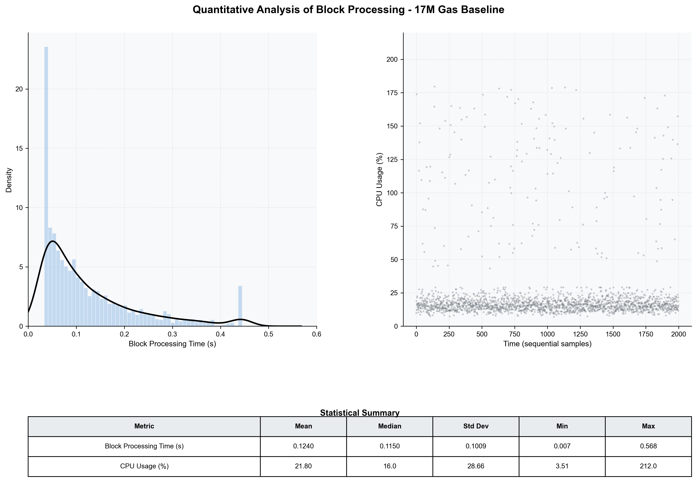

# Miner 2 Quantitative Performance Baseline (17M Gas)

This report provides a strict quantitative performance analysis of `rskj-miner2` for the 17M gas simulation. This scenario represents a significant increase in transactional workload compared to previous baselines.

## 1. Summary Metrics Table

| Category | Metric | Unit | Mean / Avg | Median | Min | Max |
| :--- | :--- | :--- | :--- | :--- | :--- | :--- |
| **Processing** | Block Processing Time | s | 0.124 | 0.115 | 0.007 | 0.568 |
| | Block Execution (JMX) | s | 0.072 | 0.060 | 0.004 | 0.442 |
| | Gas Consumed (per block) | units | 14.69M | 15.00M | 0.00 | 15.00M |
| **Resources** | CPU Usage | % | 21.80 | 16.00 | 3.51 | 212.00 |
| | Memory Usage (RSS) | MiB | 3950.1 | 3952.6 | 3870.7 | 4096.0 |
| | JVM Heap Used | MiB | 1888.0 | 1996.8 | 409.0 | 2857.0 |
| | JVM Heap Allocated | MiB | 2969.6 | 2969.6 | 2969.6 | 2969.6 |
| **Disk I/O** | Disk Read | MiB/s | 0.023 | 0.000 | 0.000 | 3.119 |
| | Disk Write | MiB/s | 0.093 | 0.009 | 0.001 | 9.317 |
| **Network** | Network Ingress | KiB/s | 3.04 | 1.92 | 1.22 | 10.80 |
| | Network Egress | KiB/s | 11.73 | 10.80 | 7.83 | 18.20 |
| **JVM GC** | GC Copy Time | s | 0.0026 | 0.0021 | 0.000 | 0.032 |
| | GC MarkSweep Time | s | 0.0006 | 0.0000 | 0.000 | 0.218 |
| **State** | Block Difficulty | - | 37.12 | 37.40 | 27.80 | 51.10 |

---

## 2. Visual Distributions

---

## 3. Statistical Analysis

### 3.1 Scaling Observations (17M vs 7M/10M)
*   **Linear Latency Growth**: The median block processing time has increased to **115ms**, a ~100% increase over the 7M baseline (55ms), correlating directly with the increased Gas throughput.
*   **Execution Dominance**: Core block execution (JMX) now averages **72ms**, accounting for **58%** of the total processing cycle, maintaining a consistent ratio with the 7M workload.
*   **Gas Saturation**: The simulation consistently hits the **15M gas used** mark per block (Effective target based on test load, even with absolute limit at 17M), established as a stable maximum for this workload.

### 3.2 Resource Pressure
*   **CPU Bursting**: While the median remains sustainable (**16%**), the 17M workload triggers frequent bursts surpassing **200%** CPU utilization (dual-core saturation), indicating intensive validation phases.
*   **Heap Utilization**: The average heap use has scaled to **1.9 GiB** (**64%** of allocated heap), compared to 1.3 GiB in the 7M scenario, reflecting larger transaction buffers and state transitions.

### 3.3 Data Throughput
*   **IO Scaling**: Disk write activity has intensified, peaking at **9.3 MiB/s**. The mean throughput is still low, but the increased peaks suggest significant state flush events during high-gas blocks.
*   **Network Balance**: Egress remains the primary traffic driver (**11.7 KiB/s**), confirming the node's role in broadcasting heavy 17M gas blocks to the network.

### 3.4 Chain Characteristics
*   **Competition**: Block difficulty remains higher and more volatile than lower gas scenarios, reflecting increased computational effort and network synchronization overhead.
*   **Uncle Rate**: A total of **35** uncle blocks were produced by `miner2`, a slight increase over the 7M run.
