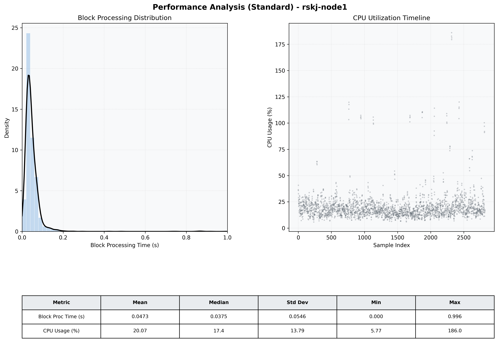

# Node1 Quantitative Performance Report

| Category | Metric | Unit | Mean | Median | Min | Max |
| :--- | :--- | :--- | :--- | :--- | :--- | :--- |
| Processing | Block Processing Time | s | 0.047 | 0.038 | 0.000 | 0.996 |
|  | BlockExecution JMX | s | 0.041 | 0.031 | 0.001 | 0.993 |
| | Gas Consumed (per block) | M units | 6.13 | 6.23 | 0.00 | 6.33 |
| Resources | CPU Usage per Container | % | 20.07 | 17.40 | 5.77 | 186.05 |
|  | Memory Usage per Container | MiB | 2953.6 | 3100.2 | 1176.4 | 4096.0 |
| JVM | JVM Heap Used | MiB | 1399.5 | 1320.1 | 117.9 | 2870.1 |
| | JVM Heap Allocated | MiB | 2969.6 | 2969.6 | 2969.6 | 2969.6 |
| JVM GC | GC Copy Time | s | 0.0016 | 0.0014 | 0.000 | 0.009 |
| JVM GC | GC MarkSweep Time | s | 0.0002 | 0.0000 | 0.000 | 0.547 |
| Disk I/O | Disk Read | MiB/s | 4.332 | 0.000 | 0.000 | 3887.996 |
|  | Disk Write | MiB/s | 82.222 | 1.241 | 0.000 | 17586.537 |
| Network | Received Network Traffic per Container | KiB/s | 2.88 | 1.83 | 0.52 | 11.66 |
|  | Sent Network Traffic per Container | KiB/s | 10.89 | 10.52 | 4.63 | 18.99 |

