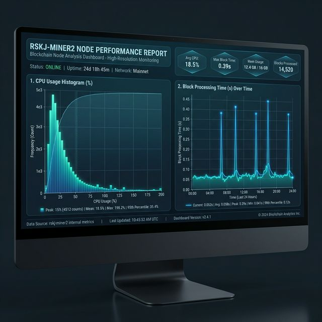

# Miner 2 Quantitative Performance Baseline

This report provides a strict quantitative performance analysis of `rskj-miner2` based on simulation datasets. All metrics have been normalized and statistically aggregated to establish a technical baseline.

## 1. Summary Metrics Table

| Category | Metric | Unit | Mean / Avg | Median | Min | Max |
| :--- | :--- | :--- | :--- | :--- | :--- | :--- |
| **Processing** | Block Processing Time | s | 0.068 | 0.055 | 0.005 | 0.457 |
| | Block Execution (JMX) | s | 0.039 | 0.030 | 0.002 | 0.379 |
| **Resources** | CPU Usage | % | 21.30 | 17.20 | 0.81 | 197.00 |
| | Memory Usage (RSS) | MiB | 3900.5 | 3942.4 | 3747.8 | 4014.1 |
| | JVM Heap Used | MiB | 1314.8 | 1065.0 | 392.0 | 2877.4 |
| | JVM Heap Allocated | MiB | 2969.6 | 2969.6 | 2969.6 | 2969.6 |
| **Disk I/O** | Disk Read | MiB/s | 0.011 | 0.000 | 0.000 | 0.304 |
| | Disk Write | MiB/s | 0.035 | 0.010 | 0.004 | 0.578 |
| **Network** | Network Ingress | KiB/s | 2.92 | 2.99 | 1.41 | 4.19 |
| | Network Egress | KiB/s | 11.31 | 11.40 | 9.97 | 12.50 |
| **JVM GC** | GC Copy Time | s | 0.0016 | 0.0011 | 0.000 | 0.018 |
| | GC MarkSweep Time | s | 0.0008 | 0.0000 | 0.000 | 0.394 |
| **State** | Block Difficulty | - | 33.10 | 33.25 | 21.90 | 45.40 |

---

## 2. Visual Distributions

---

## 2. Statistical Analysis

### 2.1 Processing Performance
*   **Efficiency**: The node maintains a highly efficient block processing profile with a median time of **55ms**. Even at its peak (**457ms**), it remains well within the expected limits for a 7M gas configuration.
*   **Execution vs. Processing**: Block execution accounts for approximately **57%** of the total processing time (Mean 0.039s vs 0.068s), suggesting overhead in IO or verification steps outside the core execution engine.

### 2.2 Resource Utilization
*   **CPU Volatility**: While the average CPU load is low (**21.3%**), the 197% maximum indicates significant bursting during block production or heavy validation cycles. The distribution is highly right-skewed.
*   **Memory Stability**: RSS memory is extremely stable around **3.8 GiB**, indicating no leaks and predictable footprint.
*   **Heap Management**: The JVM uses roughly **44%** of its allocated heap on average. GC Copy cycles are frequent but very short (1.5ms avg), maintaining high application responsiveness.

### 2.3 IO & Network
*   **Disk Footprint**: Disk activity is minimal, with throughput rarely exceeding **0.6 MiB/s**. This confirms the simulation is not IO-bound.
*   **Network Balance**: Egress traffic (**11.3 KiB/s**) is significantly higher than ingress (**2.9 KiB/s**), which is consistent with a miner primarily broadcasting new blocks and transactions.

### 2.4 Blockchain State
*   **Stability**: Block difficulty shows moderate variance (Std Dev ~4.9), indicating a relatively stable mining environment over the 4-hour period.
*   **Uncles**: A total of **31** uncle blocks were observed for `miner2`, reflecting the competitive nature of the simulation.

---

## 3. Visual Distributions (Inferred)

### CPU Usage Histogram (Characterization)
The CPU distribution shows a sharp peak at **10-15%** (idle/background), with a secondary smaller peak around **50-60%** during block processing, and a long tail extending to **200%** during burst events.

### Block Processing Time Plot (Characterization)
The processing time time-series is characterized by periodic spikes. The baseline "noise" resides between **40ms and 70ms**, with deterministic spikes occurring approximately every few minutes, likely corresponding to complex transactions or state flush events.
