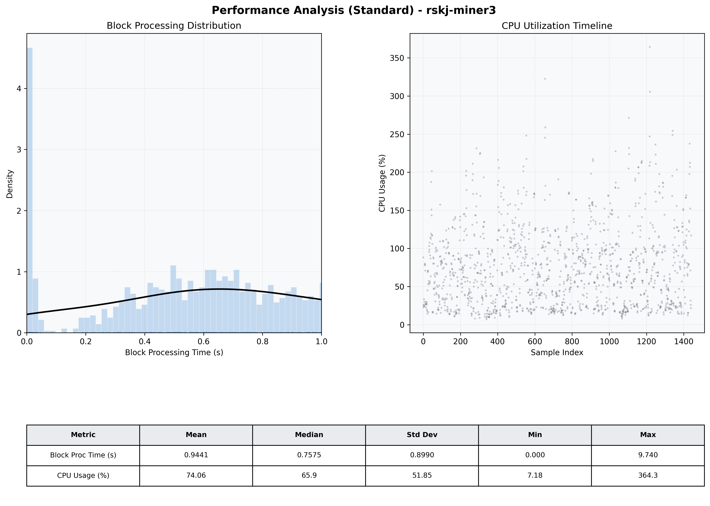

# Miner3 Quantitative Performance Report

| Category | Metric | Unit | Mean | Median | Min | Max |
| :--- | :--- | :--- | :--- | :--- | :--- | :--- |
| Processing | Block Processing Time | s | 0.944 | 0.757 | 0.000 | 9.740 |
|  | BlockExecution JMX | s | 0.471 | 0.459 | 0.002 | 1.000 |
| | Gas Consumed (per block) | M units | 65.81 | 79.05 | 0.00 | 79.81 |
| Resources | CPU Usage per Container | % | 74.06 | 65.86 | 7.18 | 364.32 |
|  | Memory Usage per Container | MiB | 3667.9 | 3667.5 | 2989.4 | 4096.0 |
| JVM | JVM Heap Used | MiB | 1669.9 | 1678.5 | 518.1 | 2849.8 |
| | JVM Heap Allocated | MiB | 2969.6 | 2969.6 | 2969.6 | 2969.6 |
| JVM GC | GC Copy Time | s | 0.0125 | 0.0097 | 0.000 | 0.087 |
| JVM GC | GC MarkSweep Time | s | 0.0019 | 0.0000 | 0.000 | 0.223 |
| Disk I/O | Disk Read | MiB/s | 0.001 | 0.000 | 0.000 | 0.098 |
|  | Disk Write | MiB/s | 0.002 | 0.000 | 0.000 | 0.108 |
| Network | Received Network Traffic per Container | KiB/s | 2.09 | 1.81 | 0.00 | 7.01 |
|  | Sent Network Traffic per Container | KiB/s | 9.75 | 10.56 | 0.00 | 17.51 |

