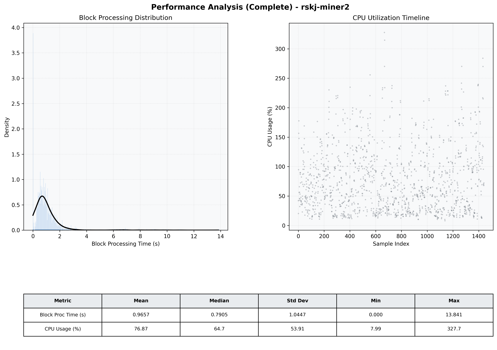

# Miner2 Quantitative Performance Report

| Category | Metric | Unit | Mean | Median | Min | Max |
| :--- | :--- | :--- | :--- | :--- | :--- | :--- |
| Processing | Block Processing Time | s | 0.966 | 0.791 | 0.000 | 13.841 |
|  | BlockExecution JMX | s | 0.674 | 0.500 | 0.002 | 12.292 |
| | Gas Consumed (per block) | M units | 65.81 | 79.05 | 0.00 | 79.81 |
| Resources | CPU Usage per Container | % | 76.87 | 64.70 | 7.99 | 327.69 |
|  | Memory Usage per Container | MiB | 3708.7 | 3720.7 | 3152.1 | 4096.0 |
| JVM | JVM Heap Used | MiB | 1654.1 | 1654.7 | 404.9 | 2852.2 |
| | JVM Heap Allocated | MiB | 2969.6 | 2969.6 | 2969.6 | 2969.6 |
| JVM GC | GC Copy Time | s | 0.0119 | 0.0094 | 0.000 | 0.118 |
| JVM GC | GC MarkSweep Time | s | 0.0015 | 0.0000 | 0.000 | 0.175 |
| Disk I/O | Disk Read | MiB/s | 0.001 | 0.000 | 0.000 | 0.087 |
|  | Disk Write | MiB/s | 0.002 | 0.000 | 0.000 | 0.100 |
| Network | Received Network Traffic per Container | KiB/s | 2.10 | 1.82 | 0.00 | 7.25 |
|  | Sent Network Traffic per Container | KiB/s | 9.73 | 10.54 | 0.00 | 17.56 |

