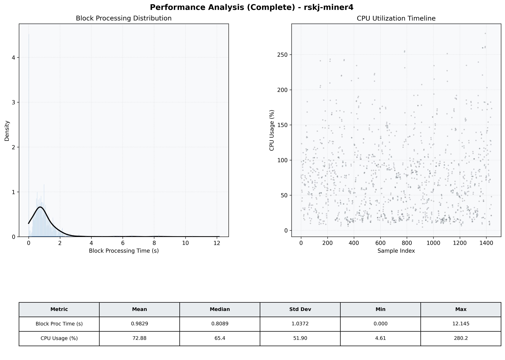

# Miner4 Quantitative Performance Report

| Category | Metric | Unit | Mean | Median | Min | Max |
| :--- | :--- | :--- | :--- | :--- | :--- | :--- |
| Processing | Block Processing Time | s | 0.983 | 0.809 | 0.000 | 12.145 |
|  | BlockExecution JMX | s | 0.672 | 0.523 | 0.002 | 11.637 |
| | Gas Consumed (per block) | M units | 65.81 | 79.05 | 0.00 | 79.81 |
| Resources | CPU Usage per Container | % | 72.88 | 65.45 | 4.61 | 280.22 |
|  | Memory Usage per Container | MiB | 3615.2 | 3620.9 | 3085.8 | 4096.0 |
| JVM | JVM Heap Used | MiB | 1651.4 | 1658.8 | 486.1 | 2848.7 |
| | JVM Heap Allocated | MiB | 2969.6 | 2969.6 | 2969.6 | 2969.6 |
| JVM GC | GC Copy Time | s | 0.0114 | 0.0090 | 0.000 | 0.127 |
| JVM GC | GC MarkSweep Time | s | 0.0016 | 0.0000 | 0.000 | 0.175 |
| Disk I/O | Disk Read | MiB/s | 0.001 | 0.000 | 0.000 | 0.099 |
|  | Disk Write | MiB/s | 0.001 | 0.000 | 0.000 | 0.107 |
| Network | Received Network Traffic per Container | KiB/s | 2.10 | 1.82 | 0.00 | 7.45 |
|  | Sent Network Traffic per Container | KiB/s | 9.75 | 10.56 | 0.00 | 19.31 |

