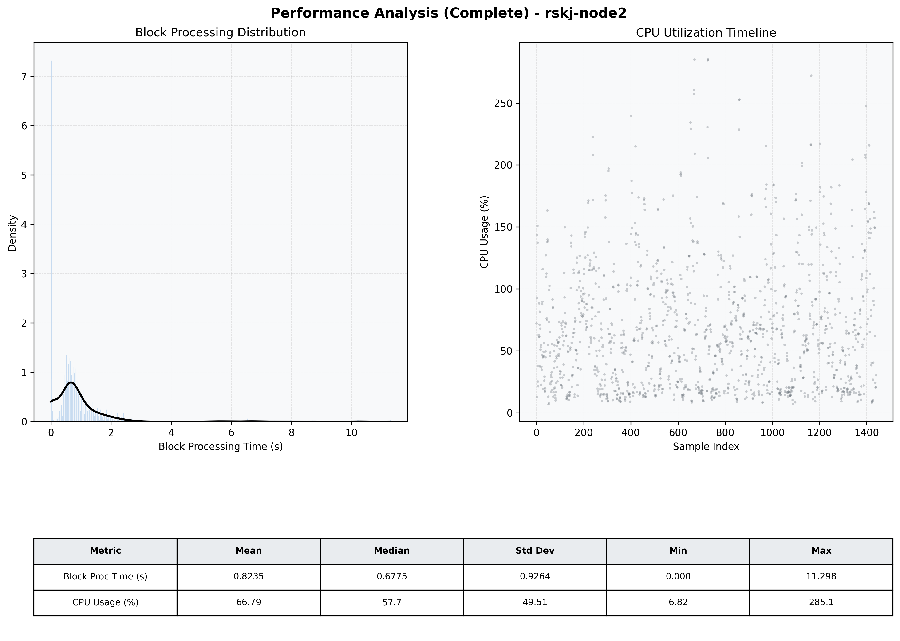

# Node2 Quantitative Performance Report

| Category | Metric | Unit | Mean | Median | Min | Max |
| :--- | :--- | :--- | :--- | :--- | :--- | :--- |
| Processing | Block Processing Time | s | 0.823 | 0.678 | 0.000 | 11.298 |
|  | BlockExecution JMX | s | 0.988 | 0.739 | 0.002 | 26.770 |
| | Gas Consumed (per block) | M units | 65.81 | 79.05 | 0.00 | 79.81 |
| Resources | CPU Usage per Container | % | 66.79 | 57.68 | 6.82 | 285.08 |
|  | Memory Usage per Container | MiB | 3671.9 | 3673.6 | 3026.6 | 4096.0 |
| JVM | JVM Heap Used | MiB | 1617.8 | 1630.5 | 369.6 | 2804.2 |
| | JVM Heap Allocated | MiB | 2969.6 | 2969.6 | 2969.6 | 2969.6 |
| JVM GC | GC Copy Time | s | 0.0113 | 0.0083 | 0.000 | 0.110 |
| JVM GC | GC MarkSweep Time | s | 0.0020 | 0.0000 | 0.000 | 0.365 |
| Disk I/O | Disk Read | MiB/s | 0.001 | 0.000 | 0.000 | 0.089 |
|  | Disk Write | MiB/s | 0.002 | 0.000 | 0.000 | 0.093 |
| Network | Received Network Traffic per Container | KiB/s | 2.13 | 1.84 | 0.00 | 7.39 |
|  | Sent Network Traffic per Container | KiB/s | 9.46 | 10.39 | 0.00 | 14.29 |

