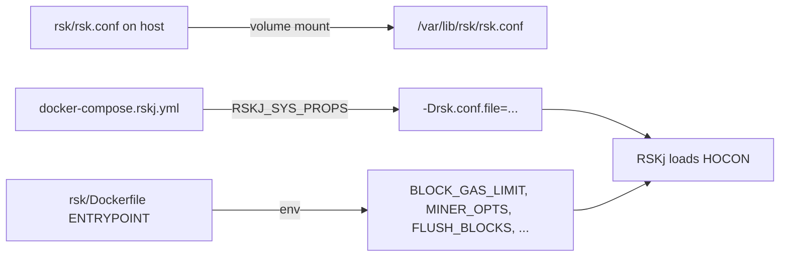
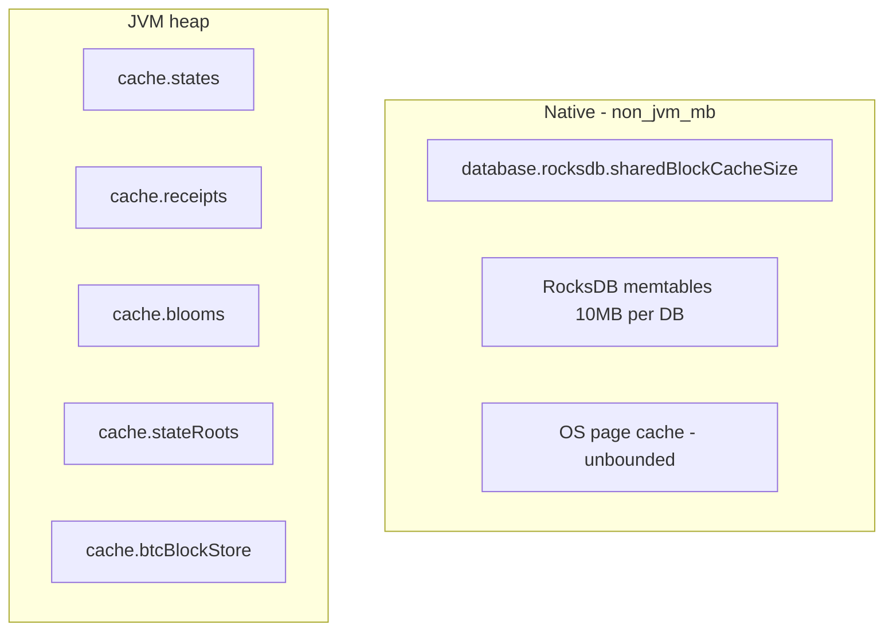

# Simulation config and caches (AI context)

Concise reference for the **rsk-simulation** deployment layer. Attach this file instead of scanning the project.

## How config reaches the node



| Source | What it controls |
|--------|------------------|
| [`rsk/rsk.conf`](../../rsk.conf) | Peers, RocksDB, JVM heap caches, RPC, miner, sync, tx pool |
| [`docker-compose.rskj.yml`](../../../docker-compose.rskj.yml) | Per-node role, CPU/RAM limits, `DEFAULT_JVM_OPTS`, genesis mount |
| `rsk/Dockerfile` ENTRYPOINT | Gas limit, flush interval, miner keys/ports (overrides some `rsk.conf` at runtime) |

Compose passes:

```text
RSKJ_SYS_PROPS=-Drsk.conf.file=/var/lib/rsk/rsk.conf -Dlogging.dir=test/local-regtest/
RSKJ_LOG_PROPS=-Dlogback.configurationFile=/var/lib/rsk/logback.xml -Dlogging.stdout=INFO -Dlogging.file=INFO -Dlogging=INFO
```

| Mounted file | Purpose |
|--------------|---------|
| `rsk/rsk.conf` | HOCON node config |
| `rsk/logback.xml` | Logback appenders and per-logger levels (`scan=true` reloads hourly) |

`logging.dir` and `logging.*` levels are JVM properties read by the mounted `logback.xml`, not HOCON.

## Two cache layers (critical for memory questions)

RSKj uses **two unrelated cache systems**. Do not conflate them.

| Layer | Config keys | Memory accounting | Bounded? |
|-------|-------------|-------------------|----------|
| **Native RocksDB** | `database.rocksdb.sharedBlockCacheSize`, `maxOpenFiles` | JNI / jemalloc → shows as **`non_jvm_mb`** in NMT | Block cache yes; page cache no |
| **JVM heap caches** | `cache.*` | Java heap → **`heap_comm_mb`** / GC | Yes (element counts) |

Linux **page cache** for SST files is a third bucket: cgroup **`cache_mb`** (not in `rsk.conf`).



## All cache-related keys in `rsk/rsk.conf`

Defaults below match current [`rsk/rsk.conf`](../../rsk.conf). Change that file, then `docker compose ... --force-recreate`.

### Native RocksDB (`database.rocksdb`)

| Key | Current sim value | Meaning |
|-----|-------------------|---------|
| `sharedBlockCacheSize` | `128M` | Single LRU shared by blocks, receipts, unitrie, blooms, etc. |
| `maxOpenFiles` | `15` | Max open SST files per DB; lowers table-reader native memory |

Code: `org/ethereum/datasource/RocksDbDataSource.java` → `createOptions()`.

### JVM heap (`cache`)

| Key | Current value | Backing store | Getter |
|-----|---------------|---------------|--------|
| `cache.states.max-elements` | `1000000` | Trie nodes during execution | `getStatesCacheSize()` |
| `cache.states.persist-snapshot` | `true` | Persist trie cache snapshot to disk | `cache.states.persist-snapshot` |
| `cache.stateRoots.max-elements` | `4000` | Pre-Wasabi root mappings | `getStateRootsCacheSize()` |
| `cache.receipts.max-elements` | `10000` | `DataSourceWithCache` on receipts DB | `getReceiptsCacheSize()` |
| `cache.blooms.max-elements` | `100000` | Block blooms | `getBloomsCacheSize()` |
| `cache.blooms.persist-snapshot` | `false` | Blooms snapshot persistence | `cache.blooms.persist-snapshot` |
| `cache.btcBlockStore.depth` | `5000` | BTC header cache depth | `getBtcBlockStoreCacheDepth()` |
| `cache.btcBlockStore.size` | `10000` | BTC header cache entries | `getBtcBlockStoreCacheSize()` |

Defaults in upstream: `repos/rskj/rskj-core/src/main/resources/reference.conf` (`cache { }` block).

Receipts also write heavily to RocksDB (2 puts/tx in `ReceiptStoreImplV2`) — fast SST growth affects **page cache**, not `cache.receipts.max-elements` alone.

### Blocks — there is no `cache.blocks`

The **`blocks`** RocksDB (`database.dir/blocks`) has **no** dedicated entry in the `cache { }` block and is **not** wrapped in `DataSourceWithCache` (unlike receipts, blooms, stateRoots, states).

| Mechanism | Configurable? | Where | Notes |
|-----------|---------------|-------|-------|
| RocksDB block bodies | Via shared native cache only | `database.rocksdb.sharedBlockCacheSize` | Same pool as all other DBs |
| RocksDB SST / page cache | Partially | `maxOpenFiles` | Kernel page cache still unbounded |
| MapDB block index | No | `blocks/index` on disk | `IndexedBlockStore` / `MapDBBlocksIndex` |
| In-process `BlockCache` | **No** (hardcoded) | `IndexedBlockStore` → `new BlockCache(500)` | JVM heap, ~500 recent blocks |
| `remascCache` | **No** (hardcoded) | `IndexedBlockStore` → `MaxSizeHashMap(5000)` | REMASC siblings |
| P2P pending blocks | **No** (hardcoded) | `NetBlockStore` → `MAX_BLOCKS=5000`, `MAX_HEADERS=10000` | Sync/orphan buffer on heap |
| Block blooms (related) | Yes | `cache.blooms.max-elements` | Separate `blooms` DB, not `blocks` DB |
| BTC peg headers | Yes | `cache.btcBlockStore.*` | **Bitcoin** blocks, not RSK chain blocks |

Block-adjacent HOCON (not memory caches):

| Key | Default | Meaning |
|-----|---------|---------|
| `blooms.blocks` | `16` | Blocks covered per bloom record (`bloomNumberOfBlocks()`) |
| `blooms.confirmations` | `400` | Confirmations before bloom is considered final |
| `blockchain.flushNumberOfBlocks` | `1000` in reference; sim uses `FLUSH_BLOCKS` env (Dockerfile) | Trie/state flush cadence |

To tune **blocks** memory today: adjust `database.rocksdb.sharedBlockCacheSize` / `maxOpenFiles`, or change code constants in `IndexedBlockStore` / `NetBlockStore` (not exposed in `rsk.conf`).

## Observability (which metric for which cache)

| Question | Metric / tool |
|----------|----------------|
| Native block cache usage | JMX `co_rsk_datasource_RocksDbStats_BlockCacheUsageBytes` (sum ≤ `sharedBlockCacheSize`) |
| Index outside block cache | `EstimateTableReadersMem` (should stay KiB-scale) |
| Unflushed writes | `CurSizeAllMemTables`, `EstimatePendingCompactionBytes` |
| Host RSS breakdown | `nmt/nmt.sh` → `non_jvm_mb`, `cache_mb` |
| Native extents | `scripts/analyze_native_memory.sh`, pmap ~128MB segments |

## Tuning hints (25M gas simulation)

| Symptom | Knob to try |
|---------|-------------|
| `non_jvm_mb` climbing | Lower `maxOpenFiles`; lower `sharedBlockCacheSize` (trade CPU) |
| Heap pressure | Lower `cache.states.max-elements` or `cache.receipts.max-elements` |
| Cgroup total / OOM | Raise `deploy.resources.limits.memory` in compose; reduce page-cache pressure via less I/O or lower `maxOpenFiles` |
| Receipts disk growth | Expected; watch `TotalSstFilesSizeBytes{exported_name="receipts"}` |

`FLUSH_BLOCKS` (compose env, default 100) is in Dockerfile ENTRYPOINT, not `rsk.conf`.

## Key file paths

| Path | Role |
|------|------|
| `rsk/rsk.conf` | Simulation HOCON (mounted) |
| `docker-compose.rskj.yml` | Node matrix + JVM opts + volumes |
| `rsk/Dockerfile` | Image build, ENTRYPOINT java flags |
| `repos/rskj/.../RocksDbDataSource.java` | RocksDB options |
| `repos/rskj/.../RskSystemProperties.java` | Config getters |
| `repos/rskj/.../reference.conf` | Upstream defaults |

## Example prompts

```
@rsk/.cursor/docs/simulation-and-caches.md Should I lower cache.states or sharedBlockCacheSize for miner2 OOM?

@rsk/rsk.conf @rsk/.cursor/docs/simulation-and-caches.md Add receipts cache tuning for high TPS
```
